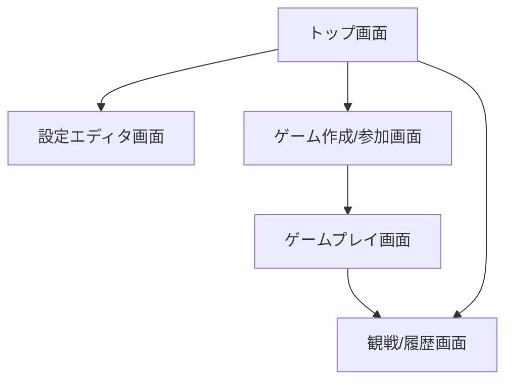
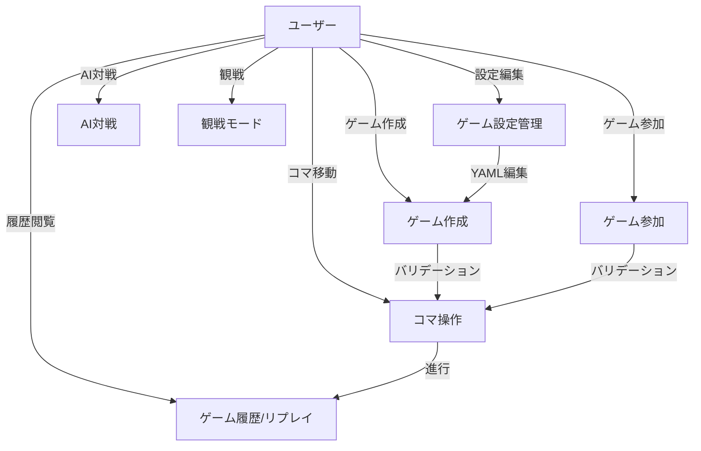

# ソフトウェア要求仕様書（SRS）

## 文書情報
- **文書名**: FlexiBoard ソフトウェア要求仕様書
- **バージョン**: 1.0
- **作成日**: 2025年7月25日
- **最終更新日**: 2025年7月25日
- **作成者**: 開発チーム
- **承認者**: [承認者名]
- **承認日**: [承認日]

## 変更履歴
| バージョン | 日付 | 変更内容 | 変更者 |
|------------|------|----------|--------|
| 1.0 | 2025-07-25 | 初版作成 | 開発チーム |

---

## 1. プロジェクト概要

### 1.1 プロジェクト名
FlexiBoard（フレキシボード）

### 1.2 プロジェクトの背景・目的
**背景**: 従来のボードゲームは固定されたルールで提供されることが多く、ユーザーが独自のルールや盤面を自由に設計・共有できるプラットフォームが不足している。

**目的**: 
- ユーザーが自由にルールを設定し、矩形盤面またはクアッドスフィア盤面でボードゲームを作成・プレイできるWebプラットフォームを提供
- 設定ファイル（YAML）による柔軟なゲーム定義機能を実現
- マルチプレイヤー対応とAI対戦機能により、多様なゲーム体験を提供

### 1.3 プロジェクトスコープ
**含まれる機能**:
- 盤面形状選択（矩形/クアッドスフィア）
- YAMLファイルによる設定管理
- WebUIによる設定編集・プレビュー・ゲーム操作
- マルチプレイヤー（最大4人）・AI対戦
- ゲーム進行・勝利条件判定
- 設定ファイルのバリデーションとエラーメッセージ表示
- 設定ファイルのインポート/エクスポート

**含まれない機能**:
- ユーザー認証・アカウント管理（MVPでは含まない）
- ゲーム観戦モード（拡張機能）
- ゲーム履歴の閲覧・リプレイ（拡張機能）
- モバイルアプリ（Webブラウザのみ対応）

### 1.4 前提条件・制約条件
**技術的前提条件**:
- サーバー：Python（Flask, Flask-SocketIO）
- クライアント：Web（HTML, CSS, JavaScript）
- 設定ファイル：YAML形式
- 主要ブラウザ対応（Chrome, Edge, Firefox, Safari）

**制約条件**:
- 盤面サイズ・コマ数に上限（最大16×16、コマ数100未満）
- サーバー・クライアントとも日本語UI対応
- 同時接続数：1サーバーあたり最大100ユーザー

### 1.5 リスク分析
| リスク項目 | 影響度 | 発生確率 | 対策 |
|------------|--------|----------|------|
| 複雑なYAML設定によるユーザビリティ低下 | 高 | 中 | 直感的なUI設計、テンプレート提供 |
| クアッドスフィア盤面の実装複雑性 | 高 | 中 | 段階的実装、十分なテスト |
| リアルタイム通信の安定性 | 高 | 低 | WebSocket接続管理、エラーハンドリング強化 |
| パフォーマンス要件の未達 | 中 | 中 | 負荷テスト、最適化 |
| セキュリティ脆弱性 | 高 | 低 | セキュリティレビュー、バリデーション強化 |

---

## 2. 用語・略語定義
- **MVP**: Minimum Viable Product（最小実用製品）
- **拡張**: MVP以降に追加予定の機能
- **RTM**: 要求トレーサビリティマトリクス
- **YAML**: 設定ファイル記述フォーマット
- **矩形盤面**: 標準的なグリッド型盤面（例：チェス、将棋）
- **クアッドスフィア盤面**: 端が反対側に接続される球面近似盤面（トーラス型）
- **WebSocket**: リアルタイム双方向通信プロトコル
- **バリデーション**: 入力データの妥当性検証

---

## 3. システム概要
本システムは、ユーザーが自由にルールを設定し、矩形盤面またはクアッドスフィア盤面でボードゲームを作成・プレイできるWebプラットフォームである。

### 3.1 システムの特徴
- **柔軟性**: YAML設定ファイルによる自由なルール定義
- **多様性**: 矩形・クアッドスフィア両方の盤面形状に対応
- **リアルタイム性**: WebSocketによる即座の状態同期
- **拡張性**: モジュール設計による機能追加の容易性

### 3.2 主要ユーザー
- **ゲーム作成者**: 独自のルールでゲームを設計・共有したいユーザー
- **ゲームプレイヤー**: 多様なボードゲームを楽しみたいユーザー
- **AI研究者**: ボードゲームAIの研究・実験を行いたいユーザー

---

## 4. 機能要件

### 4.1 機能要件一覧
| 機能ID | 機能名 | 概要 | 優先度 | MVP/拡張 |
|--------|--------|------|--------|----------|
| FR-01 | 盤面形状選択 | 矩形/クアッドスフィア盤面の選択 | 高 | MVP |
| FR-02 | 設定ファイル編集 | YAMLファイルによるゲーム設定編集 | 高 | MVP |
| FR-03 | 設定バリデーション | 設定ファイルの整合性チェック | 高 | MVP |
| FR-04 | マルチプレイ | 最大4人でのリアルタイム対戦 | 高 | MVP |
| FR-05 | AI対戦 | AIプレイヤーとの対戦 | 中 | MVP |
| FR-06 | 観戦モード | 他人のゲーム観戦 | 低 | 拡張 |
| FR-07 | 履歴リプレイ | 過去のゲーム再生 | 低 | 拡張 |
| FR-08 | 設定インポート/エクスポート | 設定ファイルの保存・共有 | 中 | MVP |

### 4.2 詳細機能要件

#### FR-01: 盤面形状選択【MVP】
- **概要**: ユーザーが矩形またはクアッドスフィア盤面を選択できる
- **入力**: 盤面形状選択（ドロップダウン）
- **出力**: 選択された盤面形状に基づくUI表示
- **検証観点**: 盤面形状選択時、UI上で正しく切り替わること

#### FR-02: 設定ファイル編集【MVP】
- **概要**: board.yaml, pieces.yaml, rules.yamlの編集機能
- **入力**: YAML形式の設定ファイル
- **出力**: 編集された設定ファイル、プレビュー表示
- **検証観点**: 設定編集・保存テスト：YAML編集後、保存・プレビューが正しく反映されること

#### FR-03: 設定バリデーション【MVP】
- **概要**: 設定ファイルの整合性チェックとエラー表示
- **入力**: 設定ファイル（board.yaml, pieces.yaml, rules.yaml）
- **出力**: バリデーション結果、エラーメッセージ
- **検証観点**: 不正値入力テスト：不正なYAML入力時に明確なエラーが表示されること

#### FR-04: マルチプレイ【MVP】
- **概要**: 最大4人でのリアルタイム対戦
- **入力**: プレイヤー操作、ゲームID
- **出力**: リアルタイム盤面更新、ターン管理
- **検証観点**: 4人同時対戦テスト：複数ユーザーで同時に操作可能であること

#### FR-05: AI対戦【MVP】
- **概要**: AIプレイヤーとの自動対戦
- **入力**: AI難易度選択、ゲーム設定
- **出力**: AI自動手番、対戦結果
- **検証観点**: AI自動手番テスト：AIが自動で手を打つこと

#### FR-06: 観戦モード【拡張】
- **概要**: 他人のゲームを観戦
- **入力**: 観戦したいゲームID
- **出力**: リアルタイム盤面表示（操作不可）
- **検証観点**: 観戦時UI・操作不可テスト：観戦者は操作できず盤面のみ閲覧可能

#### FR-07: 履歴リプレイ【拡張】
- **概要**: 過去のゲームを再生
- **入力**: 履歴選択、再生コントロール
- **出力**: 盤面遷移再生
- **検証観点**: 履歴再生テスト：過去の対局が正しく再生されること

#### FR-08: 設定インポート/エクスポート【MVP】
- **概要**: 設定ファイルの保存・共有機能
- **入力**: ファイル選択/ダウンロード要求
- **出力**: 設定ファイルの保存/ダウンロード
- **検証観点**: ファイル操作テスト：インポート・エクスポートが正しく動作すること

---

## 5. 非機能要件

### 5.1 性能要件
| 要件ID | 要件内容 | 目標値 | 測定方法 | MVP/拡張 |
|--------|----------|--------|----------|----------|
| NFR-01 | レスポンスタイム | 1手1秒以内 | サーバー/クライアント計測 | MVP |
| NFR-02 | 同時接続数 | 100ユーザー | 負荷テスト | MVP |
| NFR-03 | 履歴再生速度 | 1手1秒以内 | 再生時間計測 | 拡張 |

### 5.2 可用性要件
| 要件ID | 要件内容 | 目標値 | 測定方法 | MVP/拡張 |
|--------|----------|--------|----------|----------|
| NFR-04 | 稼働率 | 99%以上 | 月間ダウンタイム監視 | MVP |
| NFR-05 | 障害復旧時間 | 30分以内 | 障害発生から復旧まで | MVP |

### 5.3 セキュリティ要件
| 要件ID | 要件内容 | 実装方法 | MVP/拡張 |
|--------|----------|----------|----------|
| NFR-06 | 不正操作防止 | サーバー側バリデーション必須 | MVP |
| NFR-07 | WebSocket認証 | トークン認証 | MVP |
| NFR-08 | 外部攻撃防止 | CORS, CSRF, XSS対策 | MVP |

### 5.4 保守性・拡張性要件
| 要件ID | 要件内容 | 実装方針 | MVP/拡張 |
|--------|----------|----------|----------|
| NFR-09 | 新機能追加容易性 | モジュール設計 | 拡張 |
| NFR-10 | テスト容易性 | 単体テスト可能な設計 | MVP |
| NFR-11 | 設定ファイル分離 | YAML設定による柔軟性 | MVP |

### 5.5 互換性要件
| 要件ID | 要件内容 | 対応範囲 | MVP/拡張 |
|--------|----------|----------|----------|
| NFR-12 | ブラウザ対応 | Chrome, Edge, Firefox, Safari | MVP |
| NFR-13 | 日本語UI | 完全対応 | MVP |

---

## 6. 制約条件
- サーバー：Python（Flask, Flask-SocketIO）
- クライアント：Web（HTML, CSS, JavaScript）
- 設定ファイル：YAML形式
- 盤面サイズ・コマ数に上限（例：最大16×16、コマ数100未満）
- サーバー・クライアントとも日本語UI対応

---

## 7. ユーザーストーリー
- ユーザーはWebUIで盤面形状を選択し、YAMLでルールを編集できる【MVP】
- ユーザーは設定を保存し、他ユーザーと対戦できる【MVP】
- ユーザーはAIと対戦できる【MVP】
- ユーザーは不正な設定時にエラー内容を確認できる【MVP】
- ユーザーは設定ファイルをインポート/エクスポートできる【MVP】
- ユーザーは他人のゲームを観戦できる【拡張】
- ユーザーは過去のゲーム履歴をリプレイできる【拡張】

---

## 8. 要求トレーサビリティマトリクス（RTM）

| 要求ID | 要求内容 | 関連成果物 | テストケース例 |
|--------|----------|------------|----------------|
| FR-01  | 盤面形状選択【MVP】 | UI設計書, 詳細設計書 | 盤面切替テスト：矩形/クアッドスフィア選択時に盤面が正しく切り替わること |
| FR-02  | 設定ファイル編集【MVP】 | UI設計書, 詳細設計書 | 設定編集・保存テスト：YAML編集後、保存・プレビューが正しく反映されること |
| FR-03  | 設定バリデーション【MVP】 | 詳細設計書 | 不正値入力テスト：不正なYAML入力時に明確なエラーが表示されること |
| FR-04  | マルチプレイ【MVP】 | アーキテクチャ仕様書, 詳細設計書 | 4人同時対戦テスト：複数ユーザーで同時に操作可能であること |
| FR-05  | AI対戦【MVP】 | 詳細設計書 | AI自動手番テスト：AIが自動で手を打つこと |
| FR-06  | 観戦モード【拡張】 | UI設計書, 詳細設計書 | 観戦時UI・操作不可テスト：観戦者は操作できず盤面のみ閲覧可能 |
| FR-07  | 履歴リプレイ【拡張】 | UI設計書, 詳細設計書 | 履歴再生テスト：過去の対局が正しく再生されること |
| NFR-01 | 性能要件【MVP】 | 非機能要件設計書 | レスポンスタイム計測：1手1秒以内で応答すること |
| NFR-02 | セキュリティ【MVP】 | 非機能要件設計書 | 脆弱性テスト：不正アクセス・XSS等が防止されていること |
| NFR-03 | 可用性【MVP】 | 非機能要件設計書 | 障害時復旧テスト：サーバーダウン時に自動復旧すること |
| NFR-04 | 同時接続数【MVP】 | 非機能要件設計書 | 負荷テスト：100ユーザー同時接続時も正常動作すること |

---

## 9. プロトタイプ（UIモックアップ例）



- **設定エディタ画面**: 盤面形状選択（ドロップダウン）、YAMLエディタ、プレビュー盤面、バリデーション結果表示、保存/インポート/エクスポートボタン
- **ゲームプレイ画面**: 盤面グリッド、コマ操作（ドラッグ/クリック）、ターン表示、チャット欄、履歴/巻き戻し/やり直しボタン
- **観戦/履歴画面**: 盤面遷移再生コントロール、進行状況表示、観戦者リスト

---

## 10. 承認

| 役割 | 氏名 | 署名 | 日付 |
|------|------|------|------|
| プロジェクトマネージャー | [氏名] | [署名] | [日付] |
| 技術責任者 | [氏名] | [署名] | [日付] |
| 品質保証責任者 | [氏名] | [署名] | [日付] |

---

# ユースケース記述書

（以下、既存内容を明確性・一貫性の観点で微修正し、RTMと対応付け）



## 主要ユースケース記述（抜粋）

### 1. ゲーム設定管理（FR-02, FR-03）
- **目的**: 盤面・コマ・ルールをYAMLで編集し、プレビューする
- **基本フロー**:
  1. 盤面形状を選択
  2. board.yaml, pieces.yaml, rules.yamlを編集
  3. プレビューで即時反映
  4. 設定を保存/エクスポート
- **代替フロー**: 不正なYAMLの場合、エラー表示

### 2. ゲーム作成（FR-01, FR-04）
- **目的**: 新規ゲームを作成し、他ユーザーと共有
- **基本フロー**:
  1. 設定ファイルを選択
  2. バリデーション実行
  3. ゲームID発行
  4. 参加者を待つ
- **代替フロー**: バリデーションエラー時、修正依頼

### 3. ゲーム参加（FR-04）
- **目的**: 既存ゲームに参加
- **基本フロー**:
  1. ゲームID入力
  2. 参加
  3. 盤面・コマ情報を取得

### 4. コマ操作（FR-04, FR-05）
- **目的**: コマを選択し、合法手を実行
- **基本フロー**:
  1. コマをクリック
  2. 移動先を選択
  3. サーバーへ送信
  4. 盤面更新
- **代替フロー**: 不正移動時、エラー表示

### 5. AI対戦（FR-05）
- **目的**: AIと対戦
- **基本フロー**:
  1. AI難易度選択
  2. ゲーム開始
  3. AIが自動で手を打つ

### 6. 観戦モード（FR-06）
- **目的**: 他人のゲームを観戦
- **基本フロー**:
  1. 観戦したいゲームIDを選択
  2. 盤面・進行状況をリアルタイム表示

### 7. ゲーム履歴/リプレイ（FR-07）
- **目的**: 過去のゲームを再生
- **基本フロー**:
  1. 履歴一覧から選択
  2. 盤面遷移を再生

---

# クラス構成・I/F設計（基本設計観点）

## クラス図（Mermaid）


## クラス責務・主な属性/メソッド

| クラス名         | 主な責務・役割                                                                 | 主な属性/メソッド例                                                                                 |
|------------------|-------------------------------------------------------------------------------|-----------------------------------------------------------------------------------------------------|
| Game             | ゲーム全体の状態管理・進行制御                                                 | id, board, pieces, rules, players, state, make_move(), check_victory(), to_dict()                  |
| Board            | 盤面構造・特殊マス・障害物管理                                                 | type, size, special_squares, obstacles, get_square(), normalize_pos()                               |
| Piece            | コマの状態・移動処理                                                           | type, position, owner, promoted, move()                                                            |
| Rules            | ゲームルール・勝利条件・合法手判定                                             | turn_system, victory_conditions, draw_conditions, piece_reuse, validate_move()                     |
| Player           | プレイヤー情報（人間/AI）                                                      | id, name, type, ai_level                                                                            |
| Move             | 1手の情報（from/to/プレイヤー/成り）                                            | from_pos, to_pos, player_id, piece_type, promote                                                    |
| SpecialSquare    | 特殊マス情報                                                                   | position, effect, value                                                                             |
| Obstacle         | 障害物情報                                                                     | position, type                                                                                      |
| VictoryCondition | 勝利条件情報                                                                   | type, value                                                                                         |

## サーバー内部I/F（関数・メソッド）

| モジュール/クラス | I/F名                       | 入力例                                   | 出力例/説明                       |
|-------------------|-----------------------------|------------------------------------------|-----------------------------------|
| Game              | make_move(move: Move)       | Move                                    | bool（成功/失敗）                |
| Game              | check_victory()             | なし                                     | Optional[str]（勝者ID/None）      |
| Game              | to_dict()                   | なし                                     | dict（シリアライズ用）            |
| Board             | get_square(x, y)            | x: int, y: int                           | Square/None                       |
| Board             | normalize_pos(x, y)         | x: int, y: int                           | (x, y)（端のラップ処理）          |
| Rules             | validate_move(piece, from, to, board) | Piece, from_pos, to_pos, Board   | bool（合法手か）                  |
| Rules             | check_victory_condition(game_state)   | dict（現状）                     | bool                              |
| yaml_parser       | validate_settings(board, pieces, rules) | dict, dict, dict                  | None/ValidationError              |

## REST API/WS I/F（外部I/F）

| メソッド/イベント | パス/イベント名         | 入力例/データ構造                       | 出力例/データ構造                 |
|-------------------|------------------------|------------------------------------------|-----------------------------------|
| POST              | /api/games             | {board_yaml, pieces_yaml, rules_yaml}    | {game_id, status, errors}         |
| GET               | /api/games/{id}        | なし                                     | {board, pieces, rules, state}     |
| POST              | /api/games/{id}/move   | {from, to, player, promote}              | {state, errors}                   |
| GET               | /api/games/{id}/history| なし                                     | {moves, timestamps}               |
| WS                | join                   | {game_id}                                | {state}                           |
| WS                | move                   | {from, to, player, promote}              | {state, errors}                   |
| WS                | update                 | {state}                                  | {state}                           |
| WS                | error                  | {message}                                | {message}                         |

## データ構造例（JSON）

```json
{
  "game_id": "abc123",
  "board": {
    "type": "rectangular",
    "size": [8, 8],
    "special_squares": [{ "position": [4, 4], "effect": "damage", "value": 1 }],
    "obstacles": []
  },
  "pieces": [
    { "type": "king", "position": [4, 0], "owner": "player_1", "promoted": false }
  ],
  "rules": {
    "turn_system": "alternate",
    "victory_conditions": [{ "type": "capture_king", "value": "king" }],
    "piece_reuse": "on"
  },
  "players": [
    { "id": "player_1", "name": "Alice", "type": "human" },
    { "id": "player_2", "name": "AI", "type": "ai", "ai_level": "medium" }
  ],
  "state": {
    "turn": "player_1",
    "history": [ /* ... */ ]
  }
}
``` 

---

# UI設計指針・ページ一覧

## 設計すべきページ一覧

1. トップ画面
2. 設定エディタ画面
3. ゲーム作成/参加画面
4. ゲームプレイ画面
5. 観戦/履歴画面

## 各ページ設計で必要な要件

### 1. トップ画面
- 目的: ユーザーの入口、主要機能へのナビゲーション
- 必須UI要素:
  - サービスロゴ/タイトル
  - 「新規作成」「参加」「履歴/観戦」ボタン
  - サポート情報・バージョン表示
- 機能要件:
  - 各画面への遷移
  - 利用ガイド・ヘルプ表示
- 検証観点:
  - 主要機能への遷移が直感的であること
  - レスポンシブ対応

### 2. 設定エディタ画面
- 目的: 盤面・コマ・ルールのYAML編集とプレビュー
- 必須UI要素:
  - 盤面形状選択ドロップダウン
  - board.yaml, pieces.yaml, rules.yamlエディタ（タブ切替可）
  - プレビュー盤面表示
  - バリデーション結果表示
  - 保存/インポート/エクスポートボタン
- 機能要件:
  - YAML編集・即時プレビュー
  - バリデーション（エラー時は詳細表示）
  - 設定ファイルの保存・インポート・エクスポート
- 検証観点:
  - 不正YAML時のエラー表示
  - プレビューの即時反映
  - ファイル操作の正確性

### 3. ゲーム作成/参加画面
- 目的: ゲームルームの新規作成・既存ルーム参加
- 必須UI要素:
  - ゲームID入力欄
  - 設定ファイル選択/アップロード
  - 参加者リスト・待機表示
  - 「作成」「参加」ボタン
- 機能要件:
  - ゲームID発行・入力
  - 参加者待機・状態表示
  - バリデーションエラー時の修正案内
- 検証観点:
  - 正常/異常系の遷移
  - 参加人数上限の制御

### 4. ゲームプレイ画面
- 目的: 実際の対局・操作
- 必須UI要素:
  - 盤面グリッド表示
  - コマ操作（ドラッグ/クリック）
  - ターン表示
  - チャット欄
  - 履歴/巻き戻し/やり直しボタン
  - 勝敗・進行状況表示
- 機能要件:
  - 合法手のみ操作可能
  - AI手番自動進行
  - エラー時の詳細表示
  - 履歴の巻き戻し/やり直し
- 検証観点:
  - 盤面・コマ操作の正確性
  - ターン・進行状況の即時反映
  - エラー時のユーザビリティ

### 5. 観戦/履歴画面
- 目的: 他人の対局観戦・過去ゲームのリプレイ
- 必須UI要素:
  - 盤面遷移再生コントロール
  - 進行状況表示
  - 観戦者リスト
- 機能要件:
  - 観戦時は操作不可
  - 履歴再生のコントロール（再生/一時停止/巻き戻し）
  - 状況・ターン表示
- 検証観点:
  - 観戦時の操作制御
  - 履歴再生の正確性

## 共通要件
- 主要ブラウザ対応（Chrome, Edge, Firefox, Safari）
- 日本語UI
- エラーハンドリング: すべての画面で詳細なエラーメッセージを表示し、ユーザーが次のアクションを選択できること
- レスポンシブデザイン
- アクセシビリティ配慮

--- 