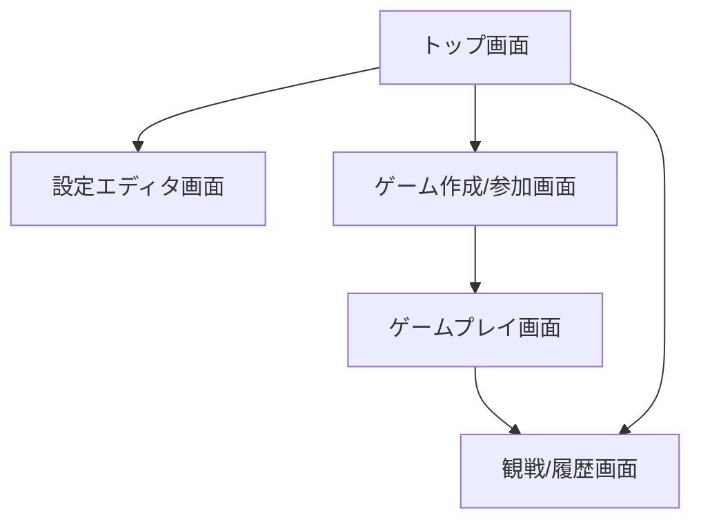
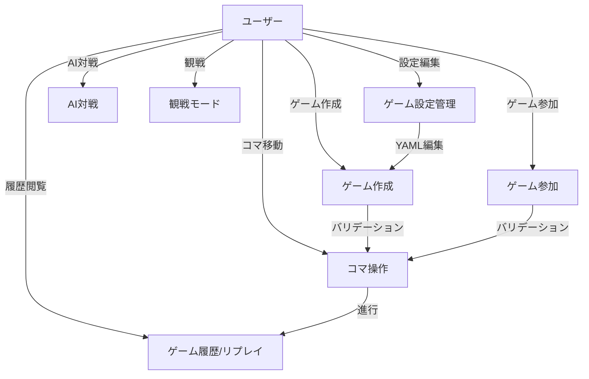
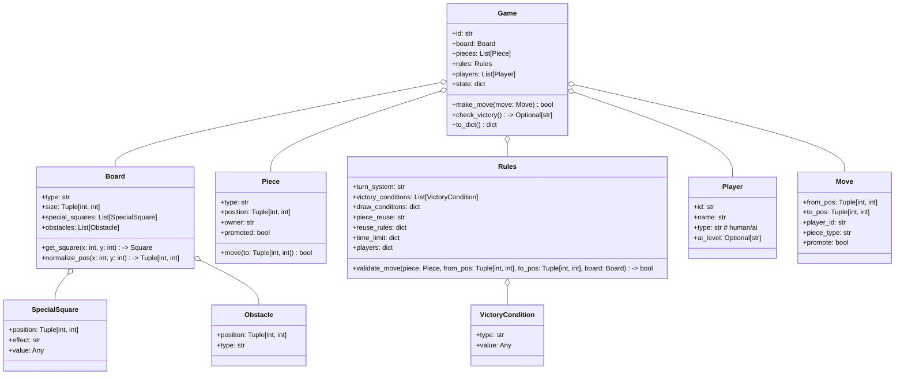

# ソフトウェア要求仕様書（SRS）

## 1. システム概要
本システムは、ユーザーが自由にルールを設定し、矩形盤面またはクアッドスフィア盤面でボードゲームを作成・プレイできるWebプラットフォームである。

## 2. 機能要件
- 盤面形状選択（矩形/クアッドスフィア）
- YAMLファイルによる設定管理（board.yaml, pieces.yaml, rules.yaml）
- WebUIによる設定編集・プレビュー・ゲーム操作
- マルチプレイヤー（最大4人）・AI対戦
- ゲーム進行・勝利条件判定
- 設定ファイルのバリデーションとエラーメッセージ表示
- 設定ファイルのインポート/エクスポート（YAML形式、ファイル選択/ダウンロード）
- ゲーム観戦モード（リアルタイム盤面表示、操作不可）
- ゲーム履歴の閲覧・リプレイ（過去の対局を再生）
- UIは主要ブラウザ（Chrome, Edge, Firefox, Safari）で動作すること

### 検証観点（例）
- 盤面形状選択時、UI上で正しく切り替わること
- 設定ファイルのバリデーションで不正値に対し明確なエラーが表示されること
- 4人同時プレイ時も1手1秒以内で応答すること
- AI対戦時、AIが自動で手を打つこと
- 履歴再生時、盤面遷移が正しく再現されること

## 3. 非機能要件
- 性能：1ゲームあたり同時4人、1手1秒以内の応答
- 可用性：99%以上（月間ダウンタイム7時間未満）
- セキュリティ：
  - 不正な設定・操作の排除（サーバー側バリデーション必須）
  - WebSocket通信の認証（トークン等）
  - 外部からの不正アクセス防止（CORS, CSRF, XSS対策）
- 拡張性：新しい盤面・ルール追加が容易
- 保守性：設定ファイル・コードの分離、テスト容易性
- サポートブラウザ：Chrome, Edge, Firefox, Safari（最新版）

## 4. 制約条件
- サーバー：Python（Flask, Flask-SocketIO）
- クライアント：Web（HTML, CSS, JavaScript）
- 設定ファイル：YAML形式
- 盤面サイズ・コマ数に上限（例：最大16×16、コマ数100未満）
- サーバー・クライアントとも日本語UI対応

## 5. ユーザーストーリー
- ユーザーはWebUIで盤面形状を選択し、YAMLでルールを編集できる
- ユーザーは設定を保存し、他ユーザーと対戦できる
- ユーザーはAIと対戦できる
- ユーザーは不正な設定時にエラー内容を確認できる
- ユーザーは設定ファイルをインポート/エクスポートできる
- ユーザーは他人のゲームを観戦できる
- ユーザーは過去のゲーム履歴をリプレイできる

## 6. 要求トレーサビリティマトリクス（RTM）

| 要求ID | 要求内容 | 関連成果物 | テストケース例 |
|--------|----------|------------|----------------|
| FR-01  | 盤面形状選択 | UI設計書, 詳細設計書 | 盤面切替テスト |
| FR-02  | 設定ファイル編集 | UI設計書, 詳細設計書 | 設定編集・保存テスト |
| FR-03  | 設定バリデーション | 詳細設計書 | 不正値入力テスト |
| FR-04  | マルチプレイ | アーキテクチャ仕様書, 詳細設計書 | 4人同時対戦テスト |
| FR-05  | AI対戦 | 詳細設計書 | AI自動手番テスト |
| FR-06  | 観戦モード | UI設計書, 詳細設計書 | 観戦時UI・操作不可テスト |
| FR-07  | 履歴リプレイ | UI設計書, 詳細設計書 | 履歴再生テスト |
| NFR-01 | 性能要件 | 非機能要件設計書 | レスポンスタイム計測 |
| NFR-02 | セキュリティ | 非機能要件設計書 | 脆弱性テスト |
| NFR-03 | 可用性 | 非機能要件設計書 | 障害時復旧テスト |

## 7. プロトタイプ（UIモックアップ例）



- **設定エディタ画面**: 盤面形状選択、YAMLエディタ、プレビュー
- **ゲームプレイ画面**: 盤面表示、コマ操作、ターン表示、チャット
- **観戦/履歴画面**: 盤面遷移の再生、進行状況の表示

---

# ユースケース記述書

（以下、既存内容を明確性・一貫性の観点で微修正し、RTMと対応付け）



## 主要ユースケース記述（抜粋）

### 1. ゲーム設定管理（FR-02, FR-03）
- **目的**: 盤面・コマ・ルールをYAMLで編集し、プレビューする
- **基本フロー**:
  1. 盤面形状を選択
  2. board.yaml, pieces.yaml, rules.yamlを編集
  3. プレビューで即時反映
  4. 設定を保存/エクスポート
- **代替フロー**: 不正なYAMLの場合、エラー表示

### 2. ゲーム作成（FR-01, FR-04）
- **目的**: 新規ゲームを作成し、他ユーザーと共有
- **基本フロー**:
  1. 設定ファイルを選択
  2. バリデーション実行
  3. ゲームID発行
  4. 参加者を待つ
- **代替フロー**: バリデーションエラー時、修正依頼

### 3. ゲーム参加（FR-04）
- **目的**: 既存ゲームに参加
- **基本フロー**:
  1. ゲームID入力
  2. 参加
  3. 盤面・コマ情報を取得

### 4. コマ操作（FR-04, FR-05）
- **目的**: コマを選択し、合法手を実行
- **基本フロー**:
  1. コマをクリック
  2. 移動先を選択
  3. サーバーへ送信
  4. 盤面更新
- **代替フロー**: 不正移動時、エラー表示

### 5. AI対戦（FR-05）
- **目的**: AIと対戦
- **基本フロー**:
  1. AI難易度選択
  2. ゲーム開始
  3. AIが自動で手を打つ

### 6. 観戦モード（FR-06）
- **目的**: 他人のゲームを観戦
- **基本フロー**:
  1. 観戦したいゲームIDを選択
  2. 盤面・進行状況をリアルタイム表示

### 7. ゲーム履歴/リプレイ（FR-07）
- **目的**: 過去のゲームを再生
- **基本フロー**:
  1. 履歴一覧から選択
  2. 盤面遷移を再生

---

# クラス構成・I/F設計（基本設計観点）

## クラス図（Mermaid）



## クラス責務・主な属性/メソッド

| クラス名         | 主な責務・役割                                                                 | 主な属性/メソッド例                                                                                 |
|------------------|-------------------------------------------------------------------------------|-----------------------------------------------------------------------------------------------------|
| Game             | ゲーム全体の状態管理・進行制御                                                 | id, board, pieces, rules, players, state, make_move(), check_victory(), to_dict()                  |
| Board            | 盤面構造・特殊マス・障害物管理                                                 | type, size, special_squares, obstacles, get_square(), normalize_pos()                               |
| Piece            | コマの状態・移動処理                                                           | type, position, owner, promoted, move()                                                            |
| Rules            | ゲームルール・勝利条件・合法手判定                                             | turn_system, victory_conditions, draw_conditions, piece_reuse, validate_move()                     |
| Player           | プレイヤー情報（人間/AI）                                                      | id, name, type, ai_level                                                                            |
| Move             | 1手の情報（from/to/プレイヤー/成り）                                            | from_pos, to_pos, player_id, piece_type, promote                                                    |
| SpecialSquare    | 特殊マス情報                                                                   | position, effect, value                                                                             |
| Obstacle         | 障害物情報                                                                     | position, type                                                                                      |
| VictoryCondition | 勝利条件情報                                                                   | type, value                                                                                         |

## サーバー内部I/F（関数・メソッド）

| モジュール/クラス | I/F名                       | 入力例                                   | 出力例/説明                       |
|-------------------|-----------------------------|------------------------------------------|-----------------------------------|
| Game              | make_move(move: Move)       | Move                                    | bool（成功/失敗）                |
| Game              | check_victory()             | なし                                     | Optional[str]（勝者ID/None）      |
| Game              | to_dict()                   | なし                                     | dict（シリアライズ用）            |
| Board             | get_square(x, y)            | x: int, y: int                           | Square/None                       |
| Board             | normalize_pos(x, y)         | x: int, y: int                           | (x, y)（端のラップ処理）          |
| Rules             | validate_move(piece, from, to, board) | Piece, from_pos, to_pos, Board   | bool（合法手か）                  |
| Rules             | check_victory_condition(game_state)   | dict（現状）                     | bool                              |
| yaml_parser       | validate_settings(board, pieces, rules) | dict, dict, dict                  | None/ValidationError              |

## REST API/WS I/F（外部I/F）

| メソッド/イベント | パス/イベント名         | 入力例/データ構造                       | 出力例/データ構造                 |
|-------------------|------------------------|------------------------------------------|-----------------------------------|
| POST              | /api/games             | {board_yaml, pieces_yaml, rules_yaml}    | {game_id, status, errors}         |
| GET               | /api/games/{id}        | なし                                     | {board, pieces, rules, state}     |
| POST              | /api/games/{id}/move   | {from, to, player, promote}              | {state, errors}                   |
| GET               | /api/games/{id}/history| なし                                     | {moves, timestamps}               |
| WS                | join                   | {game_id}                                | {state}                           |
| WS                | move                   | {from, to, player, promote}              | {state, errors}                   |
| WS                | update                 | {state}                                  | {state}                           |
| WS                | error                  | {message}                                | {message}                         |

## データ構造例（JSON）

```json
{
  "game_id": "abc123",
  "board": {
    "type": "rectangular",
    "size": [8, 8],
    "special_squares": [{ "position": [4, 4], "effect": "damage", "value": 1 }],
    "obstacles": []
  },
  "pieces": [
    { "type": "king", "position": [4, 0], "owner": "player_1", "promoted": false }
  ],
  "rules": {
    "turn_system": "alternate",
    "victory_conditions": [{ "type": "capture_king", "value": "king" }],
    "piece_reuse": "on"
  },
  "players": [
    { "id": "player_1", "name": "Alice", "type": "human" },
    { "id": "player_2", "name": "AI", "type": "ai", "ai_level": "medium" }
  ],
  "state": {
    "turn": "player_1",
    "history": [ /* ... */ ]
  }
}
``` 