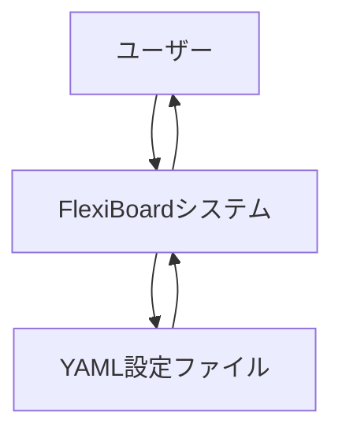
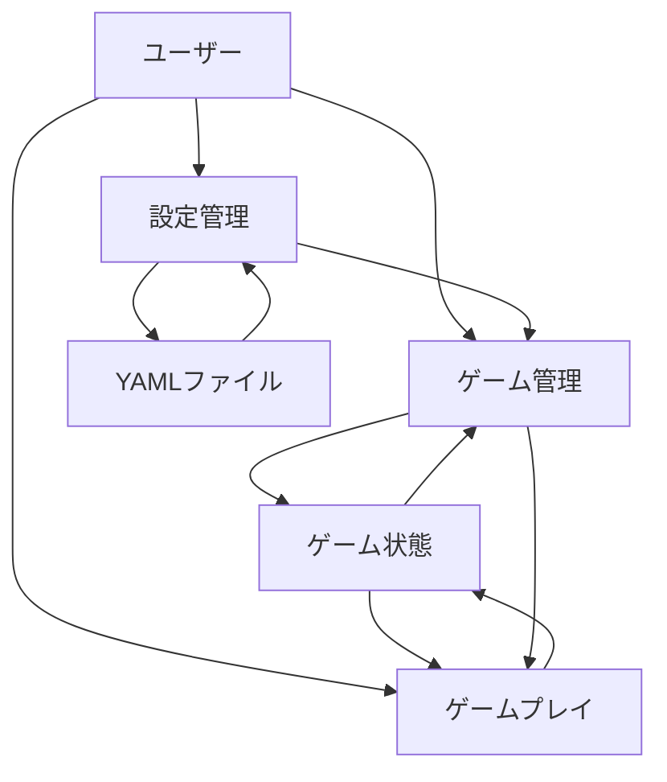
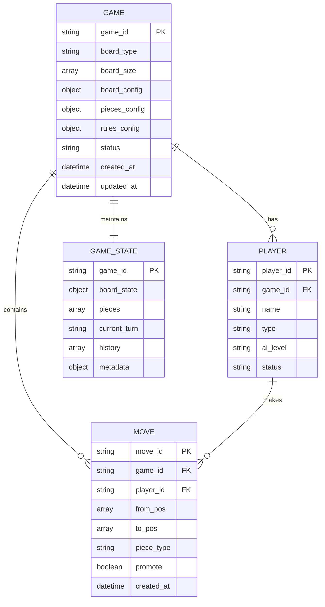
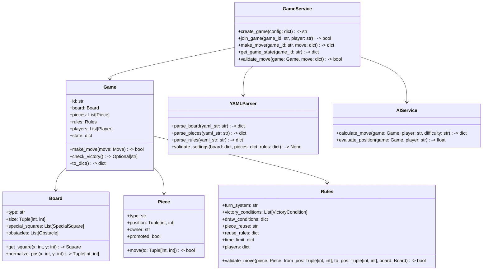

# システムアーキテクチャ仕様書

## 文書情報
- **文書名**: FlexiBoard システムアーキテクチャ仕様書
- **バージョン**: 1.0
- **作成日**: 2025年7月25日
- **最終更新日**: 2025年8月29日
- **作成者**: 開発チーム
- **承認者**: [承認者名]
- **承認日**: [承認日]

## 変更履歴
| バージョン | 日付 | 変更内容 | 変更者 |
|------------|------|----------|--------|
| 1.0 | 2025-07-25 | 初版作成 | 開発チーム |

---

## 1. プロジェクト概要

### 1.1 プロジェクト名
FlexiBoard（フレキシボード）

### 1.2 システム概要
本システムは、ユーザーが自由にルールを設定し、矩形盤面またはクアッドスフィア盤面でボードゲームを作成・プレイできるWebプラットフォームである。

### 1.3 アーキテクチャ設計の目的
- 柔軟なゲーム設定（YAML）に対応した拡張可能な設計
- リアルタイムマルチプレイヤー対応
- 高可用性・高パフォーマンスの実現
- セキュアな通信の確保

### 1.4 設計原則
- **モジュール性**: 機能ごとに独立したモジュール設計
- **拡張性**: 新しい盤面形状・ルールの追加が容易
- **保守性**: テスト可能で理解しやすいコード構造
- **セキュリティ**: サーバー側バリデーションの徹底

---

## 2. 用語・略語定義
- **WebSocket**: リアルタイム双方向通信プロトコル
- **REST API**: Representational State Transfer API
- **YAML**: 設定ファイル記述フォーマット
- **MVP**: Minimum Viable Product（最小実用製品）
- **DFD**: Data Flow Diagram（データフロー図）
- **ERD**: Entity Relationship Diagram（エンティティ関係図）
- **CORS**: Cross-Origin Resource Sharing
- **CSRF**: Cross-Site Request Forgery
- **XSS**: Cross-Site Scripting

---

## 3. リスク分析
| リスク項目 | 影響度 | 発生確率 | 対策 |
|------------|--------|----------|------|
| WebSocket接続の不安定性 | 高 | 中 | 接続管理・再接続機能の実装 |
| 同時接続数増加による性能劣化 | 高 | 中 | 負荷分散・スケーリング設計 |
| セキュリティ脆弱性 | 高 | 低 | セキュリティレビュー・バリデーション強化 |
| 複雑なYAML設定によるパースエラー | 中 | 中 | 堅牢なバリデーション・エラーハンドリング |
| ブラウザ互換性問題 | 中 | 低 | クロスブラウザテスト・ポリフィル対応 |

---

## 4. システム全体構成

### 4.1 アーキテクチャ概要
クライアントサーバー型アーキテクチャを採用し、以下で構成されます：
- **クライアント**: WebUI（HTML, CSS, JavaScript）でユーザーインターフェースを提供
- **サーバー**: Python（Flask）でゲームロジックや状態管理を担当
- **通信**: WebSocket（Flask-SocketIO）でリアルタイム通信を実現

### 4.2 システム構成図（MVP）
```mermaid
graph TD
    A[WebUI(静的配信)] --> B[Flask API/WS]
    B --> C[YAMLバリデーション]
    B --> G[ゲーム状態(メモリ)]
    A -->|WebSocket| B
```

### 4.3 技術スタック（実装確定）
| レイヤー | 技術 | バージョン | 用途 |
|----------|------|------------|------|
| フロントエンド | HTML5, CSS3, JavaScript | ES6+ | SPA構成（静的配信） |
| バックエンド | Python | 3.10+ | サーバーサイドロジック |
| Webフレームワーク | Flask | 3.1+ | HTTPサーバー/静的配信 |
| WebSocket | Flask-SocketIO | 5.5+ | リアルタイム通信 |
| 設定ファイル | YAML | 1.2 | ゲーム設定 |
| データ形式 | JSON | - | API通信 |

---

## 5. データフロー図（DFD）

### 5.1 レベル0 DFD（コンテキスト図）


### 5.2 レベル1 DFD（主要プロセス）


### 5.3 データフロー詳細
| プロセス | 入力データ | 出力データ | 処理内容 |
|----------|------------|------------|----------|
| 設定管理 | YAMLファイル | バリデーション結果 | 設定ファイルの読み込み・検証 |
| ゲーム管理 | 設定データ | ゲーム状態 | ゲームの初期化・状態管理 |
| ゲームプレイ | プレイヤー操作 | 更新されたゲーム状態 | 移動処理・勝利判定 |

---

## 6. エンティティ関係図（ERD）

### 6.1 主要エンティティ


### 6.2 エンティティ詳細
| エンティティ | 主キー | 説明 |
|--------------|--------|------|
| GAME | game_id | ゲームの基本情報 |
| PLAYER | player_id | プレイヤー情報 |
| MOVE | move_id | 手番の履歴 |
| GAME_STATE | game_id | 現在のゲーム状態 |

---

## 7. サーバーサイドクラス構造

### 7.1 クラス図


### 7.2 モジュール責務
| モジュール | 主な責務 | 主要クラス/関数 |
|------------|----------|-----------------|
| GameService | ゲーム全体の管理・進行制御 | create_game, join_game, make_move |
| Game | ゲーム状態の管理 | Game, Board, Piece, Rules |
| YAMLParser | 設定ファイルの解析・検証 | parse_board, parse_pieces, parse_rules |
| AIService | AIプレイヤーの手番計算 | calculate_move, evaluate_position |

---

## 8. 内部・外部インターフェース仕様

### 8.1 REST API仕様
| エンドポイント | メソッド | 入力 | 出力 | 説明 |
|----------------|----------|------|------|------|
| `/api/games` | POST | {board_yaml, pieces_yaml, rules_yaml} | {game_id, status, errors} | ゲーム作成 |
| `/api/games/{id}` | GET | なし | {board, pieces, rules, state} | ゲーム状態取得 |
| `/api/games/{id}/move` | POST | {from, to, player, promote} | {state, errors} | 手番実行 |
| `/api/games/{id}/history` | GET | なし | {moves, timestamps} | 履歴取得 |

### 8.2 WebSocketイベント仕様
| イベント名 | 方向 | データ構造 | 説明 |
|------------|------|------------|------|
| `join` | クライアント→サーバー | {game_id} | ゲーム参加 |
| `move` | クライアント→サーバー | {from, to, player, promote} | 手番送信 |
| `update` | サーバー→クライアント | {state} | 状態更新 |
| `error` | サーバー→クライアント | {message} | エラー通知 |

### 8.3 データ構造例
```json
{
  "game_id": "abc123",
  "board": {
    "type": "rectangular",
    "size": [8, 8],
    "special_squares": [{ "position": [4, 4], "effect": "damage", "value": 1 }],
    "obstacles": []
  },
  "pieces": [
    { "type": "king", "position": [4, 0], "owner": "player_1", "promoted": false }
  ],
  "rules": {
    "turn_system": "alternate",
    "victory_conditions": [{ "type": "capture_king", "value": "king" }],
    "piece_reuse": "on"
  },
  "players": [
    { "id": "player_1", "name": "Alice", "type": "human" },
    { "id": "player_2", "name": "AI", "type": "ai", "ai_level": "medium" }
  ],
  "state": {
    "turn": "player_1",
    "history": [ /* ... */ ]
  }
}
```

---

## 9. 非機能要件の詳細設計

### 9.1 性能要件設計
| 要件 | 目標値 | 実装方針 | 測定方法 |
|------|--------|----------|----------|
| レスポンスタイム | 1手1秒以内 | 非同期処理、キャッシュ活用 | サーバー/クライアント計測 |
| 同時接続数 | 100ユーザー | 接続プール、メモリ最適化 | 負荷テスト |
| スループット | 1000 req/sec | 効率的なアルゴリズム | ベンチマークテスト |

### 9.2 スケーラビリティ設計
- **水平スケーリング**: 複数サーバーでの負荷分散
- **垂直スケーリング**: サーバーリソースの増強
- **データベース**: 必要に応じて分散化

### 9.3 セキュリティ設計
| 脅威 | 対策 | 実装方法 |
|------|------|----------|
| 不正アクセス | 認証・認可 | トークンベース認証 |
| データ改ざん | バリデーション | サーバー側検証 |
| XSS攻撃 | 入力サニタイゼーション | エスケープ処理 |
| CSRF攻撃 | トークン検証 | CSRFトークン |

### 9.4 保守性設計
- **モジュール化**: 機能ごとの独立したモジュール
- **テスト容易性**: 単体テスト可能な設計
- **ログ管理**: 詳細なログ出力
- **設定外部化**: 環境変数・設定ファイル

### 9.5 サポート・運用設計
- **監視**: システム状態の監視
- **バックアップ**: データの定期バックアップ
- **障害対応**: 障害発生時の復旧手順
- **アップデート**: 安全なアップデート手順

---

## 10. 承認

| 役割 | 氏名 | 署名 | 日付 |
|------|------|------|------|
| プロジェクトマネージャー | [氏名] | [署名] | [日付] |
| 技術責任者 | [氏名] | [署名] | [日付] |
| 品質保証責任者 | [氏名] | [署名] | [日付] |

--- 