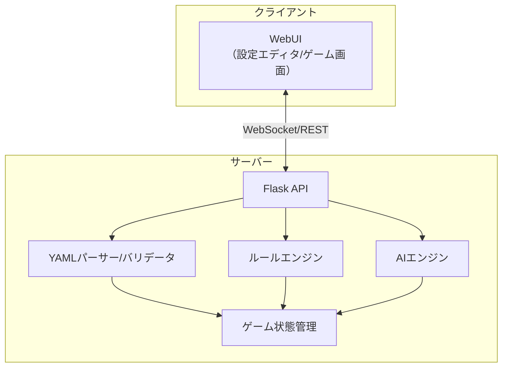
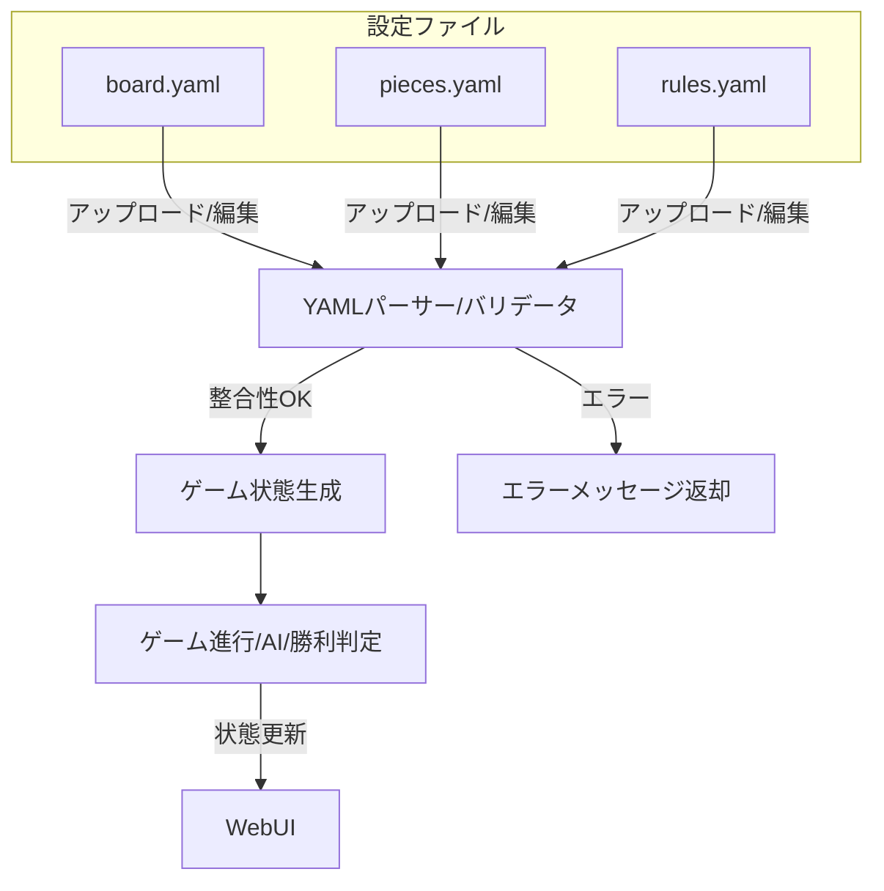
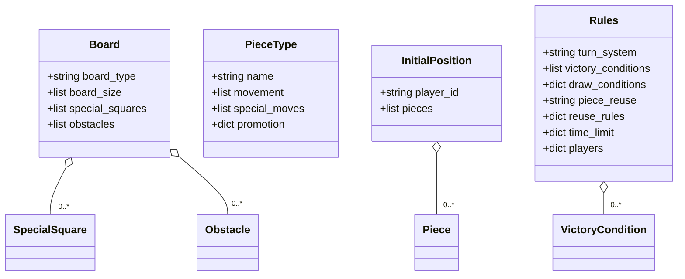

# システム構成仕様書

## 1. 全体アーキテクチャ

---

## 2. ファイル構成・データフロー

---

## 3. 各コンポーネントの役割

| コンポーネント         | 役割                                                                 |
|----------------------|--------------------------------------------------------------------|
| WebUI                | 設定編集、盤面プレビュー、コマ操作、エラー表示                      |
| Flask API            | クライアントとの通信、リクエスト受付                                |
| YAMLパーサー/バリデータ | 設定ファイルの読み込み・不整合チェック                              |
| ルールエンジン        | ゲーム進行・勝利条件判定                                            |
| AIエンジン            | AIプレイヤーの手を計算（ミニマックス/モンテカルロ木探索）           |
| ゲーム状態管理        | 盤面・コマ・ターン等の状態を保持                                    |

---

## 4. 設定ファイル構造（Mermaidクラス図）

