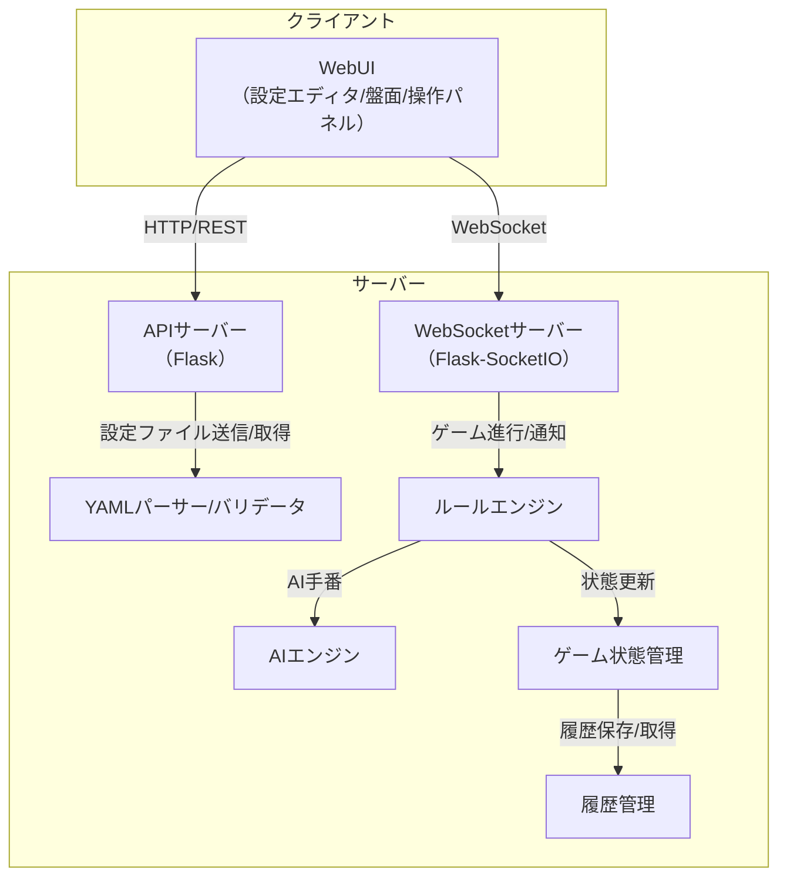
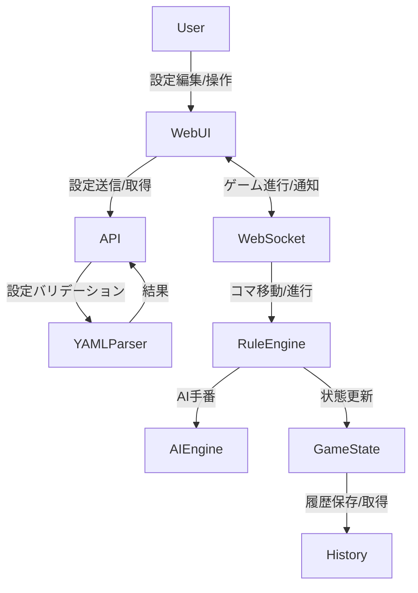
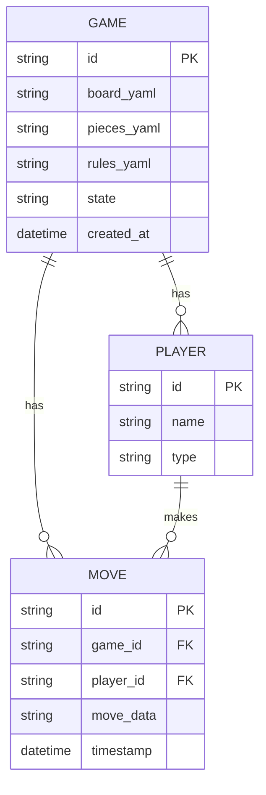
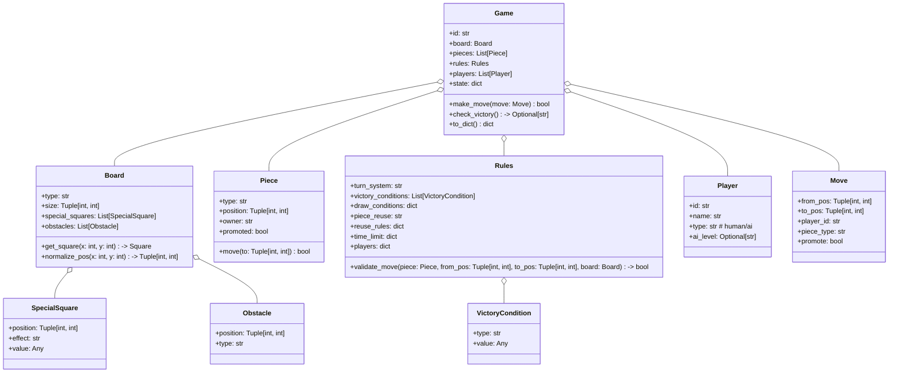
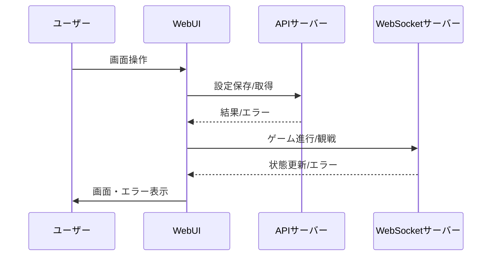

# システムアーキテクチャ仕様書

## 1. システム全体構成



- **注記**: クライアント/サーバー分離により、UI・ロジックの独立性と拡張性を確保。
- **API/WS分離**: 設定管理はREST、ゲーム進行はWebSocketでリアルタイム性を担保。

---

## 2. データフロー図（DFD, Level 1）



- **注記**: 設定・進行・履歴の各データフローが明確に分離されている。

---

## 3. データモデル（ER図）



- **注記**: 設定ファイル・状態・履歴が正規化されており、拡張や分析が容易。

---

## 4. クラス構成（サーバーサイド）



- **注記**: クラス間の責務分離により、保守性・再利用性・テスト容易性を確保。

---

## 4.1 モジュール責務・入出力・エラー処理フロー（補足）

| モジュール         | 主な責務                                 | 主な入出力例                                   | 主なエラー処理例                       |
|--------------------|------------------------------------------|-----------------------------------------------|----------------------------------------|
| APIサーバー        | REST API受付・認証・設定管理             | board.yaml, pieces.yaml, rules.yaml           | バリデーションエラー、認証エラー        |
| WebSocketサーバー  | ゲーム進行・リアルタイム通知             | move, join, update                            | 不正操作エラー、通信切断                |
| YAMLパーサー       | 設定ファイルのパース・バリデーション     | board.yaml, pieces.yaml, rules.yaml           | フォーマットエラー、整合性エラー        |
| ルールエンジン     | 合法手判定・勝利条件判定                 | ゲーム状態、Move                              | 不正手エラー、勝利条件未成立            |
| AIエンジン         | AI手番計算                               | ゲーム状態                                    | 計算不能エラー                          |
| ゲーム状態管理     | ゲーム進行・履歴管理                     | ゲーム状態、Move                              | 履歴不整合エラー                        |
| 履歴管理           | ゲーム履歴保存・取得                     | ゲームID、履歴データ                          | 履歴取得エラー                          |

---

## 5. インターフェース仕様書

### サーバー内部I/F（関数・メソッド）

| モジュール/クラス | I/F名                       | 入力例                                   | 出力例/説明                       |
|-------------------|-----------------------------|------------------------------------------|-----------------------------------|
| Game              | make_move(move: Move)       | Move                                    | bool（成功/失敗）                |
| Game              | check_victory()             | なし                                     | Optional[str]（勝者ID/None）      |
| Game              | to_dict()                   | なし                                     | dict（シリアライズ用）            |
| Board             | get_square(x, y)            | x: int, y: int                           | Square/None                       |
| Board             | normalize_pos(x, y)         | x: int, y: int                           | (x, y)（端のラップ処理）          |
| Rules             | validate_move(piece, from, to, board) | Piece, from_pos, to_pos, Board   | bool（合法手か）                  |
| Rules             | check_victory_condition(game_state)   | dict（現状）                     | bool                              |
| yaml_parser       | validate_settings(board, pieces, rules) | dict, dict, dict                  | None/ValidationError              |

- **注記**: すべてのI/Fは型・責務が明確で、テスト容易性を考慮。

### REST API/WS I/F（外部I/F）

| メソッド/イベント | パス/イベント名         | 入力例/データ構造                       | 出力例/データ構造                 | 主なエラーケース例 |
|-------------------|------------------------|------------------------------------------|-----------------------------------|-------------------|
| POST              | /api/games             | {board_yaml, pieces_yaml, rules_yaml}    | {game_id, status, errors}         | バリデーションエラー、認証エラー |
| GET               | /api/games/{id}        | なし                                     | {board, pieces, rules, state}     | 存在しないID、認証エラー         |
| POST              | /api/games/{id}/move   | {from, to, player, promote}              | {state, errors}                   | 不正手、ターン外操作、認証エラー |
| GET               | /api/games/{id}/history| なし                                     | {moves, timestamps}               | 存在しないID、認証エラー         |
| WS                | join                   | {game_id, token}                         | {state}                           | 認証エラー、存在しないID         |
| WS                | move                   | {from, to, player, promote}              | {state, errors}                   | 不正手、ターン外操作、認証エラー |
| WS                | update                 | {state}                                  | {state}                           | -                 |
| WS                | error                  | {message}                                | {message}                         | -                 |

- **注記**: API/WSはREST/リアルタイム用途で明確に分離。

---

## 6. 非機能要件設計書

### 性能
- 1ゲームあたり同時4人、1手1秒以内の応答（サーバー/クライアント両方で計測）
- 履歴再生時も1手1秒以内で盤面遷移

### スケーラビリティ
- サーバーは複数プロセス/インスタンスで水平分散可能な設計
- 設定ファイル・履歴はストレージ分離し、将来的な分散DB対応も考慮

### セキュリティ
- WebSocket/RESTともに認証トークン必須
- すべての入力値はサーバー側でバリデーション
- CORS, CSRF, XSS, SQLインジェクション等の対策を徹底
- 履歴・設定ファイルはユーザーごとにアクセス制御

### 保守性・拡張性
- モジュール分割（YAMLパーサー/ルールエンジン/AI/履歴管理）
- クラス設計により新ルール・新盤面追加が容易
- テスト容易性（各I/Fは単体テスト可能な粒度）

### サポート・運用
- ログ出力（操作・エラー・セキュリティイベント）
- 障害時の自動復旧（プロセス監視/再起動）

---

## 6.1 セキュリティ設計（具体策補足）
- すべてのREST/WSリクエストで認証トークン必須（JWT等）
- CORSポリシーで許可ドメイン制限
- CSRFトークンによるPOST/WS保護
- すべての入力値はサーバー側でバリデーション
- XSS対策：出力時エスケープ
- SQLインジェクション対策：ORM/プリペアドステートメント利用
- 履歴・設定ファイルはユーザーごとにアクセス制御

---

## 7. データ構造例（JSON）

```json
{
  "game_id": "abc123",
  "board": {
    "type": "rectangular",
    "size": [8, 8],
    "special_squares": [{ "position": [4, 4], "effect": "damage", "value": 1 }],
    "obstacles": []
  },
  "pieces": [
    { "type": "king", "position": [4, 0], "owner": "player_1", "promoted": false }
  ],
  "rules": {
    "turn_system": "alternate",
    "victory_conditions": [{ "type": "capture_king", "value": "king" }],
    "piece_reuse": "on"
  },
  "players": [
    { "id": "player_1", "name": "Alice", "type": "human" },
    { "id": "player_2", "name": "AI", "type": "ai", "ai_level": "medium" }
  ],
  "state": {
    "turn": "player_1",
    "history": [ /* ... */ ]
  }
}
```

---

## 8. モジュール性・拡張性・保守性の補足
- 主要機能は独立したモジュール/クラスで実装し、将来的な機能追加や仕様変更に柔軟に対応可能。
- クラス設計・I/F設計は単体テスト・自動テストを前提とし、CI/CD導入も容易。
- 設定ファイル・履歴・ユーザー情報は疎結合で管理し、他システム連携やデータ移行も容易。 

---

# UI設計観点の補足

## 各UIページのシステム内での役割・連携

| ページ名             | 主な役割・入出力 | サーバー連携 | 主なAPI/WS | エラーハンドリング |
|----------------------|------------------|--------------|------------|-------------------|
| トップ画面           | 主要機能へのナビ | なし         | なし       | 画面遷移失敗時の通知|
| 設定エディタ画面     | 設定編集・保存   | REST         | /api/games (POST), /api/games/{id} (GET) | バリデーションエラー、保存失敗時の詳細表示|
| ゲーム作成/参加画面  | ルーム作成/参加  | REST/WS      | /api/games (POST), join (WS) | 参加失敗・ID不正時の通知|
| ゲームプレイ画面     | 対局・操作       | WS           | move, update, error (WS) | 不正手・通信断・進行不能時の詳細表示|
| 観戦/履歴画面        | 観戦・リプレイ   | REST/WS      | /api/games/{id}/history (GET), update (WS) | 再生失敗・データ不整合時の通知|

- 各ページはAPI/WSを通じてサーバーと連携し、リアルタイム性・エラー通知・状態同期を実現する。
- UI上のエラーは、API/WSレスポンスのエラー内容を詳細に表示し、ユーザーが次のアクションを選択できるようにする。
- 画面遷移・状態遷移は、システム構成図・DFD・シーケンス図に明示。

## UI-API/WS連携フロー例（Mermaid）



--- 