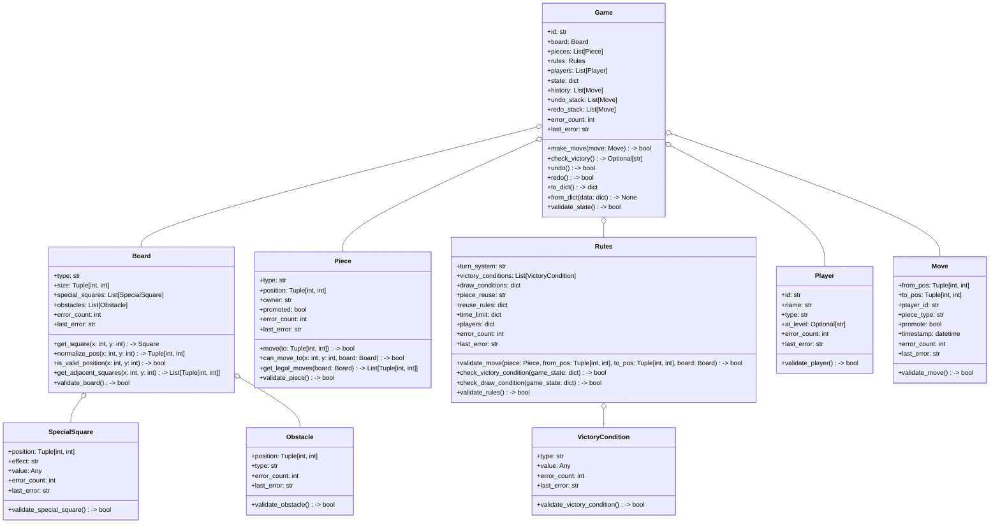
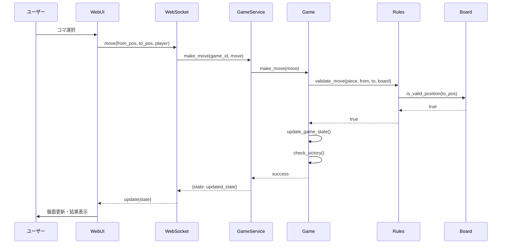
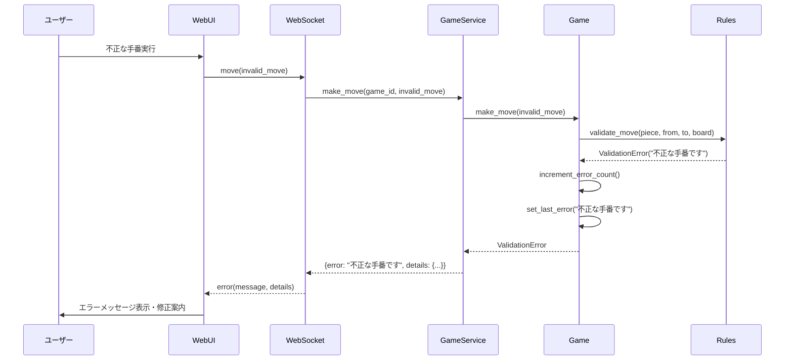
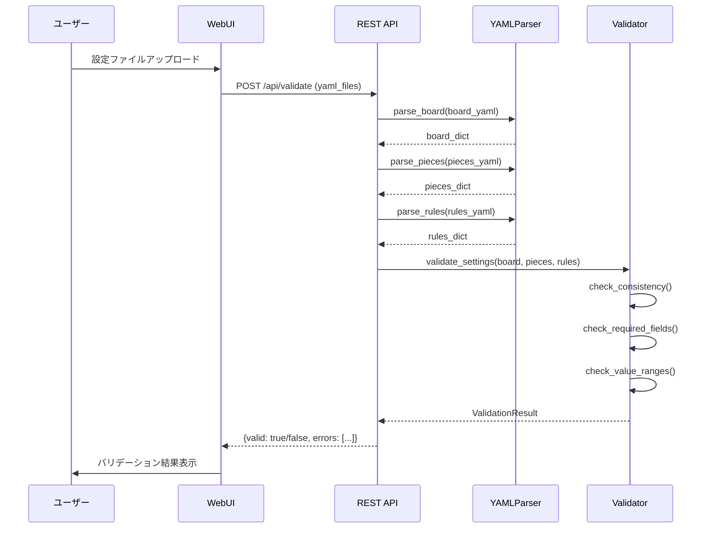

# 詳細設計書

## 文書情報
- **文書名**: FlexiBoard 詳細設計書
- **バージョン**: 1.0
- **作成日**: 2025年7月25日
- **最終更新日**: 2025年8月29日
- **作成者**: 開発チーム
- **承認者**: [承認者名]
- **承認日**: [承認日]

## 変更履歴
| バージョン | 日付 | 変更内容 | 変更者 |
|------------|------|----------|--------|
| 1.0 | 2025-07-25 | 初版作成 | 開発チーム |

---

## 1. プロジェクト概要

### 1.1 プロジェクト名
FlexiBoard（フレキシボード）

### 1.2 システム概要
本システムは、ユーザーが自由にルールを設定し、矩形盤面またはクアッドスフィア盤面でボードゲームを作成・プレイできるWebプラットフォームである。

### 1.3 詳細設計の目的
- 実装可能なレベルでのクラス設計・アルゴリズム定義
- エラーハンドリング・バリデーションの詳細化
- パフォーマンス・セキュリティの実装方針明確化

### 1.4 設計方針（MVP適用）
- **実装可能性**: 具体的なコードレベルでの設計
- **保守性**: 理解しやすく拡張可能な構造
- **テスト容易性**: 単体テスト可能な粒度での設計
- **エラー耐性**: 堅牢なエラーハンドリング（MVPでは最小限の例外処理とログ出力）

---

## 1.x MVPにおける実装済み/簡易化箇所
- 実装済み: 位置正規化（クアッドスフィア）、サーバー側YAMLバリデーション、移動履歴の記録とWS配信
- 簡易化: 厳密な合法手判定・勝利判定は将来拡張（現状は盤外/正規化/履歴のみ）

---

## 2. 用語・略語定義
- **undo/redo**: 操作の取り消し・やり直し機能
- **バリデーション**: 入力データの妥当性検証
- **エラーハンドリング**: エラー発生時の処理
- **アルゴリズム**: 問題解決のための手順
- **シーケンス図**: オブジェクト間の相互作用を時系列で表現
- **クラス図**: クラスとその関係を表現する図
- **MVP**: Minimum Viable Product（最小実用製品）

---

## 3. リスク分析
| リスク項目 | 影響度 | 発生確率 | 対策 |
|------------|--------|----------|------|
| 複雑なアルゴリズムによる実装困難 | 高 | 中 | 段階的実装・十分なテスト |
| パフォーマンス要件の未達 | 高 | 中 | アルゴリズム最適化・プロファイリング |
| エラーハンドリングの不備 | 高 | 中 | 包括的なテスト・エラーケース網羅 |
| セキュリティ脆弱性 | 高 | 低 | セキュリティレビュー・バリデーション強化 |
| 保守性の低下 | 中 | 中 | 適切な設計パターン・ドキュメント整備 |

---

## 4. クラス構成（詳細）

### 4.1 クラス図（詳細版）


### 4.2 クラス責務・主な属性/メソッド（詳細版）

| クラス名         | 主な責務・役割                                                                 | 主な属性/メソッド例                                                                                 | エラーハンドリング                                                                                   |
|------------------|-------------------------------------------------------------------------------|-----------------------------------------------------------------------------------------------------|-----------------------------------------------------------------------------------------------------|
| Game             | ゲーム全体の状態管理・進行制御・undo/redo機能                                 | id, board, pieces, rules, players, state, history, undo_stack, redo_stack, make_move(), undo(), redo() | error_count, last_error, validate_state()                                                           |
| Board            | 盤面構造・特殊マス・障害物管理・位置正規化                                     | type, size, special_squares, obstacles, get_square(), normalize_pos(), is_valid_position()              | error_count, last_error, validate_board()                                                           |
| Piece            | コマの状態・移動処理・合法手計算                                             | type, position, owner, promoted, move(), can_move_to(), get_legal_moves()                              | error_count, last_error, validate_piece()                                                           |
| Rules            | ゲームルール・勝利条件・合法手判定・引き分け判定                             | turn_system, victory_conditions, draw_conditions, validate_move(), check_victory_condition()             | error_count, last_error, validate_rules()                                                           |
| Player           | プレイヤー情報（人間/AI）・バリデーション                                     | id, name, type, ai_level                                                                               | error_count, last_error, validate_player()                                                          |
| Move             | 1手の情報・タイムスタンプ・バリデーション                                     | from_pos, to_pos, player_id, piece_type, promote, timestamp                                            | error_count, last_error, validate_move()                                                            |
| SpecialSquare    | 特殊マス情報・バリデーション                                                 | position, effect, value                                                                                 | error_count, last_error, validate_special_square()                                                  |
| Obstacle         | 障害物情報・バリデーション                                                   | position, type                                                                                          | error_count, last_error, validate_obstacle()                                                        |
| VictoryCondition | 勝利条件情報・バリデーション                                                 | type, value                                                                                              | error_count, last_error, validate_victory_condition()                                               |

---

## 5. サーバー内部I/F（関数・メソッド）詳細

### 5.1 入力・出力型・エラーケース詳細

| モジュール/クラス | I/F名                       | 入力例                                   | 出力例/説明                       | 主なエラーケース例                                                                                   |
|-------------------|-----------------------------|------------------------------------------|-----------------------------------|-----------------------------------------------------------------------------------------------------|
| Game              | make_move(move: Move)       | Move(from_pos=(1,1), to_pos=(2,2), ...) | bool（成功/失敗）                | 不正手、ターン外操作、盤面外移動、既存コマとの重複                                                   |
| Game              | check_victory()             | なし                                     | Optional[str]（勝者ID/None）      | 勝利条件未成立、複数勝利条件の競合                                                                   |
| Game              | undo()                      | なし                                     | bool（成功/失敗）                | 履歴なし、undo_stack空                                                                               |
| Game              | redo()                      | なし                                     | bool（成功/失敗）                | redo_stack空                                                                                         |
| Game              | to_dict()                   | なし                                     | dict（シリアライズ用）            | シリアライズ失敗、メモリ不足                                                                         |
| Game              | from_dict(data: dict)       | dict（デシリアライズ用）                 | None/ValidationError             | 不正なデータ形式、必須フィールド欠損                                                                 |
| Board             | get_square(x, y)            | x: int, y: int                           | Square/None                       | 盤面外座標、不正な座標型                                                                             |
| Board             | normalize_pos(x, y)         | x: int, y: int                           | (x, y)（端のラップ処理）          | 不正な座標型、計算エラー                                                                             |
| Board             | is_valid_position(x, y)     | x: int, y: int                           | bool（有効/無効）                | 不正な座標型                                                                                         |
| Piece             | can_move_to(x, y, board)    | x: int, y: int, Board                    | bool（移動可能/不可能）          | 不正な座標、盤面外、障害物衝突                                                                       |
| Piece             | get_legal_moves(board)      | Board                                    | List[Tuple[int, int]]            | 盤面不正、計算エラー                                                                                 |
| Rules             | validate_move(piece, from, to, board) | Piece, from_pos, to_pos, Board   | bool（合法手か）                  | 不正な座標、ターン外、ルール違反                                                                     |
| Rules             | check_victory_condition(game_state)   | dict（現状）                     | bool                              | 不正なゲーム状態、勝利条件未定義                                                                     |
| yaml_parser       | validate_settings(board, pieces, rules) | dict, dict, dict                  | None/ValidationError              | YAML形式エラー、必須項目欠損、整合性エラー                                                           |

### 5.2 エラーハンドリング詳細

| エラー種別         | 発生箇所例                           | 処理方法                                                                                             | ユーザーへの通知                                                                                     |
|--------------------|--------------------------------------|-----------------------------------------------------------------------------------------------------|-----------------------------------------------------------------------------------------------------|
| バリデーションエラー | 設定ファイル読み込み時               | ValidationError例外発生、詳細メッセージ付き                                                         | エラー箇所・修正方法を具体的に表示                                                                   |
| 不正操作エラー     | ターン外の手番実行時                 | 操作を無視、エラーメッセージ返却                                                                     | 「あなたのターンではありません」等の明確なメッセージ                                                 |
| 通信エラー         | WebSocket接続断時                   | 再接続試行、一定回数失敗でエラー状態                                                                 | 接続状態・再接続ボタンの表示                                                                         |
| システムエラー     | メモリ不足・予期しない例外           | ログ出力、安全な状態への復旧                                                                         | 「システムエラーが発生しました。しばらく待ってから再試行してください」                               |
| タイムアウトエラー | AI計算時間超過時                     | 計算中断、デフォルト手番実行                                                                         | 「AIの計算に時間がかかっています」等の状況通知                                                       |

---

## 6. 主要アルゴリズム詳細

### 6.1 移動判定アルゴリズム（validate_move）

```python
def validate_move(piece: Piece, from_pos: Tuple[int, int], to_pos: Tuple[int, int], board: Board, rules: Rules) -> bool:
    """
    移動の妥当性を判定するアルゴリズム
    
    Args:
        piece: 移動対象のコマ
        from_pos: 移動元座標
        to_pos: 移動先座標
        board: 盤面情報
        rules: ゲームルール
    
    Returns:
        bool: 移動が妥当な場合True
    
    Raises:
        ValidationError: 移動が不正な場合
    """
    try:
        # 1. 基本チェック
        if not board.is_valid_position(*from_pos) or not board.is_valid_position(*to_pos):
            raise ValidationError("座標が盤面外です")
        
        if from_pos == to_pos:
            raise ValidationError("移動元と移動先が同じです")
        
        # 2. コマ存在チェック
        if not piece or piece.position != from_pos:
            raise ValidationError("指定された位置にコマが存在しません")
        
        # 3. 移動先チェック
        target_square = board.get_square(*to_pos)
        if target_square and target_square.piece and target_square.piece.owner == piece.owner:
            raise ValidationError("味方のコマがある位置には移動できません")
        
        # 4. 移動パターンチェック
        if not piece.can_move_to(*to_pos, board):
            raise ValidationError("このコマは指定された位置に移動できません")
        
        # 5. 特殊ルールチェック
        if not rules.validate_special_rules(piece, from_pos, to_pos, board):
            raise ValidationError("特殊ルールにより移動できません")
        
        return True
        
    except Exception as e:
        piece.error_count += 1
        piece.last_error = str(e)
        raise ValidationError(f"移動判定エラー: {e}")
```

### 6.2 勝利条件判定アルゴリズム（check_victory）

```python
def check_victory(game: Game) -> Optional[str]:
    """
    勝利条件を判定するアルゴリズム
    
    Args:
        game: ゲーム状態
    
    Returns:
        Optional[str]: 勝者のID、勝利条件未成立時はNone
    
    Raises:
        ValidationError: 勝利条件判定エラーの場合
    """
    try:
        for condition in game.rules.victory_conditions:
            if condition.type == "capture_king":
                # 王を取った場合の勝利判定
                kings = [p for p in game.pieces if p.type == "king"]
                if len(kings) < len(game.players):
                    # 王が取られた場合、取ったプレイヤーが勝利
                    for piece in game.pieces:
                        if piece.type == "king":
                            return piece.owner
            
            elif condition.type == "reach_goal":
                # 特定位置到達による勝利判定
                goal_pos = condition.value
                for piece in game.pieces:
                    if piece.position == goal_pos:
                        return piece.owner
            
            elif condition.type == "elimination":
                # 全滅による勝利判定
                remaining_players = set(piece.owner for piece in game.pieces)
                if len(remaining_players) == 1:
                    return list(remaining_players)[0]
        
        return None
        
    except Exception as e:
        game.error_count += 1
        game.last_error = str(e)
        raise ValidationError(f"勝利条件判定エラー: {e}")
```

### 6.3 クアッドスフィア盤面の位置正規化アルゴリズム

```python
def normalize_pos(x: int, y: int, board_size: Tuple[int, int]) -> Tuple[int, int]:
    """
    クアッドスフィア盤面での位置正規化アルゴリズム
    
    Args:
        x: X座標
        y: Y座標
        board_size: 盤面サイズ (width, height)
    
    Returns:
        Tuple[int, int]: 正規化された座標
    
    Raises:
        ValidationError: 座標計算エラーの場合
    """
    try:
        width, height = board_size
        
        # X座標の正規化（左右の端を接続）
        normalized_x = x % width
        if normalized_x < 0:
            normalized_x += width
        
        # Y座標の正規化（上下の端を接続）
        normalized_y = y % height
        if normalized_y < 0:
            normalized_y += height
        
        return (normalized_x, normalized_y)
        
    except Exception as e:
        raise ValidationError(f"位置正規化エラー: {e}")
```

### 6.4 AI手番計算アルゴリズム（簡易版）

```python
def calculate_ai_move(game: Game, player: str, difficulty: str) -> Optional[Move]:
    """
    AIの手番を計算するアルゴリズム
    
    Args:
        game: ゲーム状態
        player: AIプレイヤーID
        difficulty: 難易度（easy/medium/hard）
    
    Returns:
        Optional[Move]: 計算された手番、計算できない場合はNone
    
    Raises:
        ValidationError: AI計算エラーの場合
    """
    try:
        # プレイヤーのコマを取得
        player_pieces = [p for p in game.pieces if p.owner == player]
        
        if not player_pieces:
            return None
        
        # 難易度に応じた計算
        if difficulty == "easy":
            # ランダムな手番
            import random
            piece = random.choice(player_pieces)
            legal_moves = piece.get_legal_moves(game.board)
            if legal_moves:
                to_pos = random.choice(legal_moves)
                return Move(
                    from_pos=piece.position,
                    to_pos=to_pos,
                    player_id=player,
                    piece_type=piece.type,
                    promote=False
                )
        
        elif difficulty == "medium":
            # 簡単な評価関数による手番選択
            best_move = None
            best_score = float('-inf')
            
            for piece in player_pieces:
                legal_moves = piece.get_legal_moves(game.board)
                for to_pos in legal_moves:
                    # 仮想的に手番を実行して評価
                    temp_game = copy.deepcopy(game)
                    temp_move = Move(
                        from_pos=piece.position,
                        to_pos=to_pos,
                        player_id=player,
                        piece_type=piece.type,
                        promote=False
                    )
                    if temp_game.make_move(temp_move):
                        score = evaluate_position(temp_game, player)
                        if score > best_score:
                            best_score = score
                            best_move = temp_move
            
            return best_move
        
        return None
        
    except Exception as e:
        raise ValidationError(f"AI計算エラー: {e}")
```

---

## 7. シーケンス図（ゲーム進行・エラーハンドリング）

### 7.1 正常なゲーム進行フロー



### 7.2 エラーハンドリングフロー



### 7.3 設定ファイルバリデーションフロー



---

## 8. 補足詳細（DB設計・API仕様・UI設計）

### 8.1 データベース設計詳細

| テーブル名 | 主キー | 外部キー | 主要カラム | インデックス |
|------------|--------|----------|------------|--------------|
| games | game_id | - | board_type, board_size, status, created_at | game_id, status, created_at |
| players | player_id | game_id | name, type, ai_level, status | game_id, type |
| moves | move_id | game_id, player_id | from_pos, to_pos, piece_type, promote, timestamp | game_id, timestamp |
| game_states | game_id | - | board_state, pieces, current_turn, history | game_id |

### 8.2 API仕様詳細

| エンドポイント | メソッド | リクエストボディ | レスポンス | ステータスコード |
|----------------|----------|------------------|------------|------------------|
| `/api/games` | POST | {board_yaml, pieces_yaml, rules_yaml} | {game_id, status} | 201 Created |
| `/api/games/{id}` | GET | - | {board, pieces, rules, state} | 200 OK |
| `/api/games/{id}/move` | POST | {from, to, player, promote} | {state, errors} | 200 OK / 400 Bad Request |
| `/api/games/{id}/undo` | POST | {player} | {state, errors} | 200 OK / 400 Bad Request |
| `/api/games/{id}/redo` | POST | {player} | {state, errors} | 200 OK / 400 Bad Request |

### 8.3 UI設計詳細

| 画面要素 | 機能 | イベント | エラーハンドリング |
|----------|------|----------|-------------------|
| 盤面グリッド | コマ表示・選択 | click, drag | 無効な操作時の視覚的フィードバック |
| コマ | 移動・プロモーション | drag, drop | 不正な移動先のハイライト表示 |
| ターン表示 | 現在のプレイヤー表示 | - | ターン外操作の無効化 |
| 履歴パネル | 手番履歴表示 | click | 履歴データ取得失敗時のメッセージ |
| エラーメッセージ | エラー表示 | - | エラー詳細の展開・折りたたみ |

---

## 9. 承認

| 役割 | 氏名 | 署名 | 日付 |
|------|------|------|------|
| プロジェクトマネージャー | [氏名] | [署名] | [日付] |
| 技術責任者 | [氏名] | [署名] | [日付] |
| 品質保証責任者 | [氏名] | [署名] | [日付] |

--- 