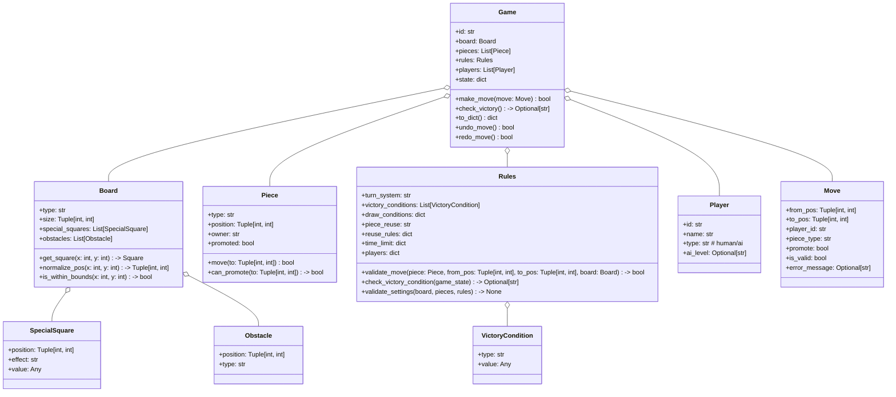
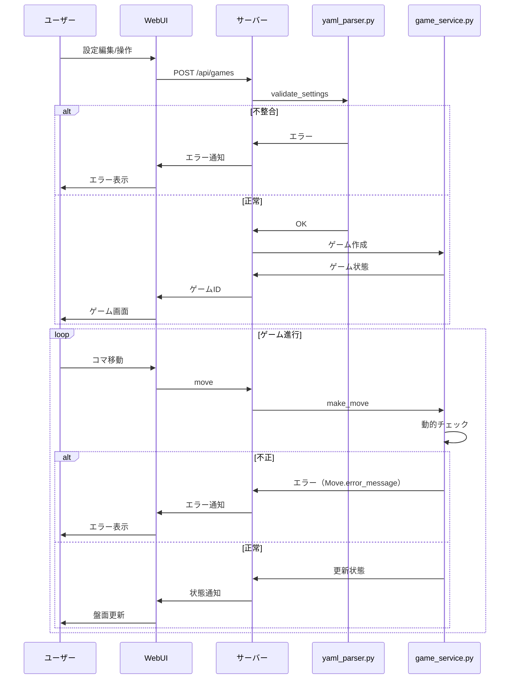
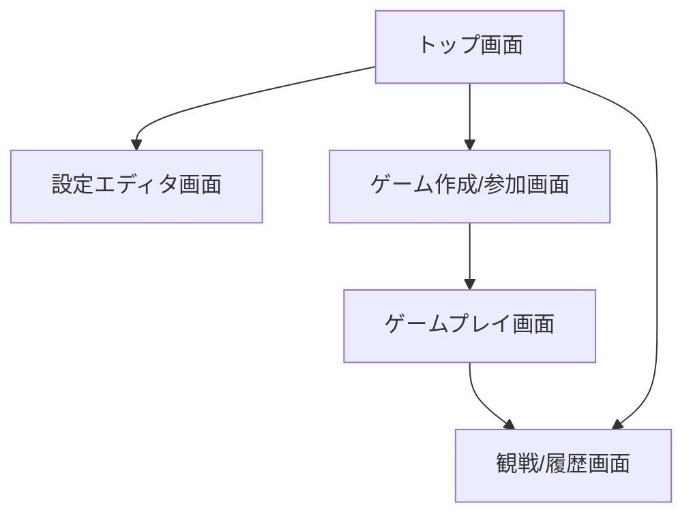
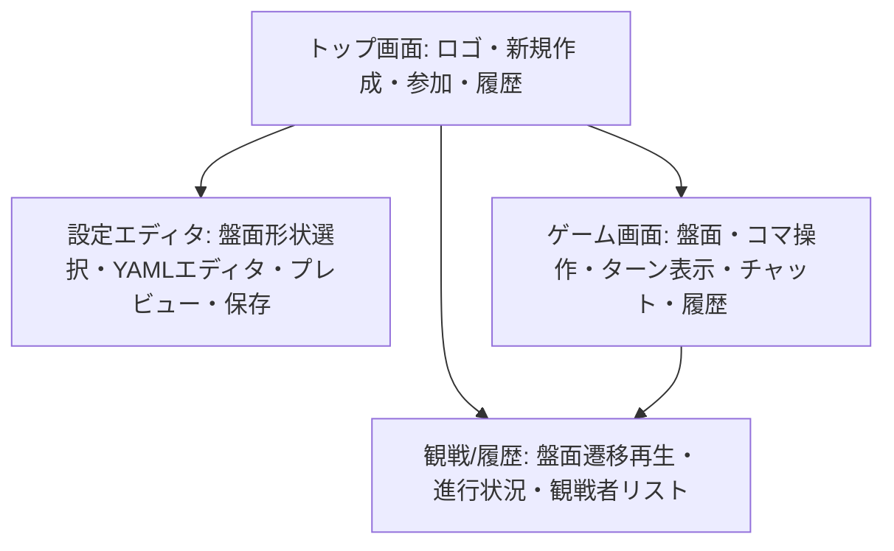
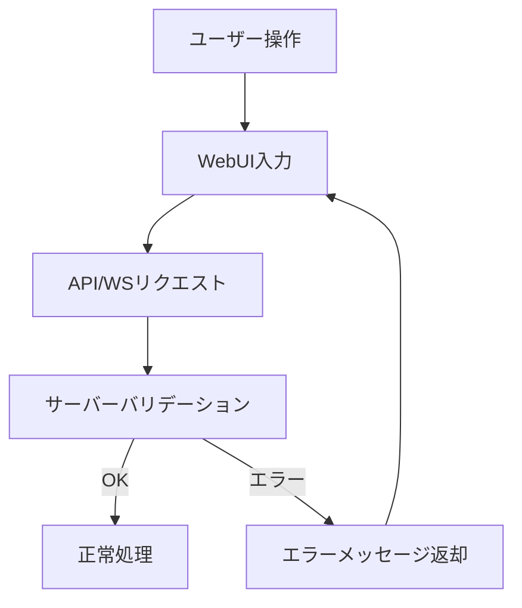

# 詳細設計書

## 1. クラス構成（再掲・補足）

- **補足**: undo/redo, is_within_bounds, can_promote, is_valid, error_message等を追加し、保守性・再利用性・エラー処理を強化。

---

## 1.1 クラス・メソッドの入出力型・例外・エラーケース（補足）

| クラス/メソッド                | 入力型                       | 出力型                       | 例外・エラーケース例                       |
|-------------------------------|------------------------------|------------------------------|--------------------------------------------|
| Game.make_move(move)           | Move                         | bool                         | 不正手（Move.is_valid=False, error_message）|
| Game.undo_move(), redo_move()  | なし                         | bool                         | 履歴なし、巻き戻し不可                      |
| Board.get_square(x, y)         | int, int                     | Square/None                  | 範囲外アクセス                             |
| Board.normalize_pos(x, y)      | int, int                     | (int, int)                   | -                                          |
| Piece.move(to)                 | (int, int)                   | bool                         | 不正移動、成り不可                         |
| Rules.validate_move(...)       | Piece, from, to, Board       | bool/str                     | 移動ルール違反、障害物衝突                 |
| Rules.check_victory_condition  | dict                         | Optional[str]                | -                                          |
| Rules.validate_settings        | board, pieces, rules         | None/ValidationError         | 設定不整合                                 |

---

## 2. 主要モジュールの内部ロジック・アルゴリズム

### 2.1 Gameクラス
- ゲーム全体の状態管理、進行制御、履歴管理
- 主なメソッド：
  - `make_move(move: Move)`: 合法手判定→状態更新→履歴追加。異常時はMove.is_valid=False, error_messageに理由を格納。
  - `undo_move()`, `redo_move()`: 履歴を用いた巻き戻し/やり直し。UIからも呼び出し可能。
  - `check_victory()`: 勝利条件判定。勝者IDまたはNoneを返す。
  - `to_dict()`: シリアライズ

### 2.2 Boardクラス
- 盤面構造・特殊マス・障害物管理
- クアッドスフィア盤面時はnormalize_posで端ラップ処理
- 主なメソッド：
  - `get_square(x, y)`: 指定座標のマス情報取得
  - `normalize_pos(x, y)`: 端ラップ処理
  - `is_within_bounds(x, y)`: 盤面内判定（矩形盤面時）

### 2.3 Pieceクラス
- コマの状態・移動・成り処理
- 主なメソッド：
  - `move(to)`: 位置更新、成り判定
  - `can_promote(to)`: 成り可能か判定

### 2.4 Rulesクラス
- 合法手判定・勝利条件判定・バリデーション
- 主なメソッド：
  - `validate_move(piece, from, to, board)`: 移動ルール・障害物・特殊マス考慮。違反時は理由を返す。
  - `check_victory_condition(game_state)`: 現在状態で勝利条件成立か判定
  - `validate_settings(board, pieces, rules)`: 設定ファイルの整合性検証

### 2.5 エラー処理・異常系設計方針
- すべてのユーザー入力・APIリクエストはサーバー側でバリデーション
- 不正な操作・設定時は詳細なエラーメッセージを返却
- 予期せぬ例外はログ出力し、UIには一般的なエラー通知を表示
- 履歴巻き戻し・やり直し時も一貫した状態復元を保証

---

## 3. 主要アルゴリズム例

### 3.1 合法手判定（Rules.validate_move）
1. コマの移動ルール（movement, special_moves）を取得
2. 盤面形状（矩形/クアッドスフィア）に応じて座標正規化
3. 障害物・特殊マスの有無を確認
4. 目的地が盤面内（またはラップ後）か判定
5. 他コマとの衝突・特殊ルール（ジャンプ等）を考慮
6. 合法ならTrue、不正ならFalseと理由

### 3.2 勝利条件判定（Rules.check_victory_condition）
1. victory_conditionsリストを順に評価
2. 例：capture_kingなら盤面上にkingが存在するか
3. control_centerなら指定マスを占有しているか
4. scoreならポイント到達か
5. いずれか成立で勝者を返す

---

## 4. シーケンス図（ゲーム進行・エラー処理含む）

---

## 5. データベース設計書（補足）
- 各テーブルの主キー・外部キー・インデックス・制約条件を明記
- 履歴テーブルはゲームID・手番順・タイムスタンプでインデックス
- 設定ファイルはゲームごとにバージョン管理可能

---

## 6. API仕様書（補足）
- すべてのAPIはバリデーションエラー時に400、認証エラー時に401、サーバーエラー時に500を返す
- 入力・出力のJSONスキーマ例を明記
- エラー時はerror_messageフィールドで詳細を返却

---

## 7. UI設計書

### 7.1 画面レイアウト例

### 7.2 主要UI要素
- **設定エディタ画面**: 盤面形状選択ドロップダウン、YAMLエディタ、プレビュー盤面、バリデーション結果表示、保存/インポート/エクスポートボタン
- **ゲームプレイ画面**: 盤面グリッド、コマ操作（ドラッグ/クリック）、ターン表示、チャット欄、履歴/巻き戻し/やり直しボタン
- **観戦/履歴画面**: 盤面遷移再生コントロール、進行状況表示、観戦者リスト

---

## 7.3 主要画面ワイヤーフレーム例（Mermaid）

---

## 8. 再利用性・保守性・最適化の補足
- すべてのクラス・APIは単体テスト可能な粒度で設計
- 盤面・コマ・ルールの追加/変更は設定ファイルのみで対応可能
- 履歴・巻き戻し・やり直し機能により、ユーザー体験とデバッグ性を向上
- エラー処理・バリデーションは共通モジュール化し、再利用性・保守性を高める 

---

## 8.1 エラー処理・異常系フロー図（Mermaid）

- 例：不正なYAML/不正手/認証エラー時は詳細なエラーメッセージをUIに返却 