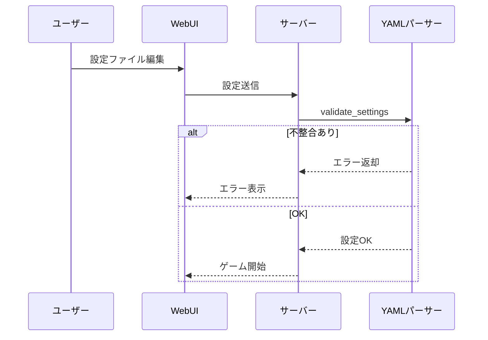
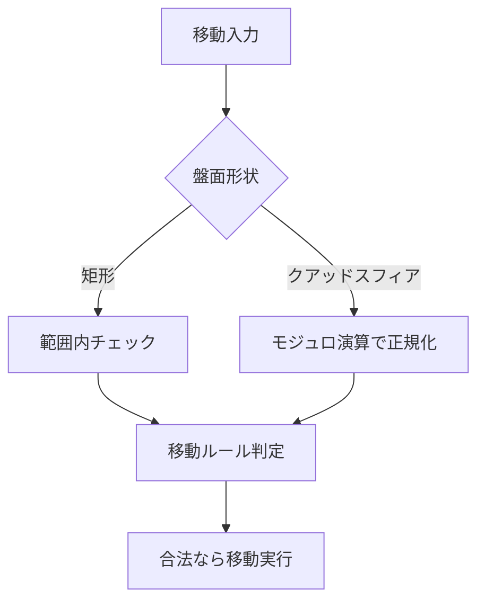
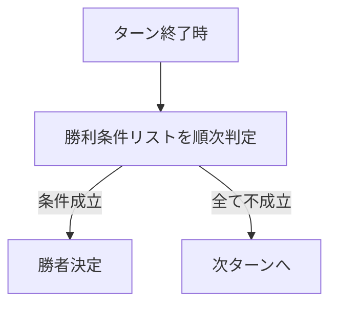
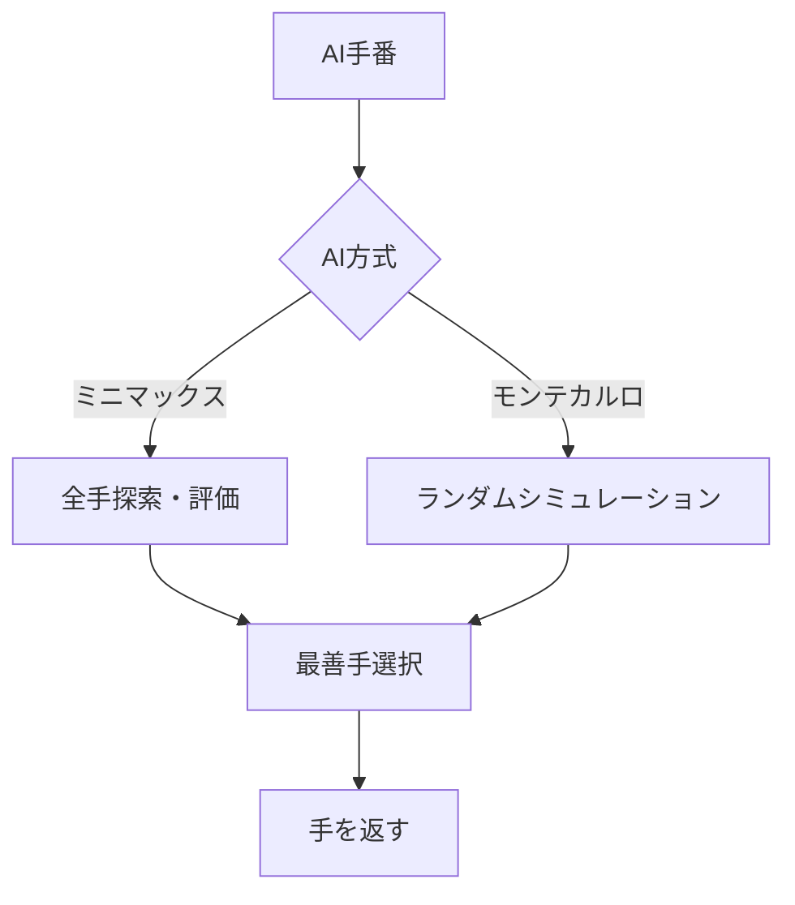

# アルゴリズム仕様書

## 1. 設定ファイルバリデーション（YAMLパーサー）

### 概要
- board.yaml, pieces.yaml, rules.yaml の整合性を一括検証
- 盤面サイズ・コマ配置・勝利条件・ルールの相互矛盾を検出

### チェックフロー（シーケンス図）

### 主なバリデーションロジック（擬似コード）

- board_type, board_size, special_squares, obstacles の妥当性
- piece_types のユニーク性・movement/promotion の妥当性
- initial_positions の座標・重複・type の存在確認
- rules.yaml の victory_conditions/piece_reuse/players の妥当性

---

## 2. 盤面・コマの移動処理

### 盤面形状ごとの座標処理

- **矩形盤面**：0 <= x < width, 0 <= y < height
- **クアッドスフィア**：x = x % width, y = y % height

---

## 3. 勝利条件判定

### 勝利条件の種類と判定タイミング

| 種類             | 判定内容例                                      |
|------------------|-----------------------------------------------|
| capture_king     | 指定コマが捕獲されたか                         |
| eliminate_all    | 相手コマが全て除去されたか                     |
| control_center   | 中央マスを占領しているか                       |
| reach_square     | 特定マスに到達したか                           |
| score            | ポイントが目標値に到達したか                   |

### 判定フロー

---

## 4. AIアルゴリズム（概要）

- **ミニマックス法**：全手を探索し、最善手を選択
- **モンテカルロ木探索**：ランダムプレイアウトで勝率の高い手を選択

---

## 5. 不整合チェックの詳細

- 盤面サイズ・コマ配置・勝利条件・ルールの相互矛盾を検出
- エラー例・メッセージ例を明記 