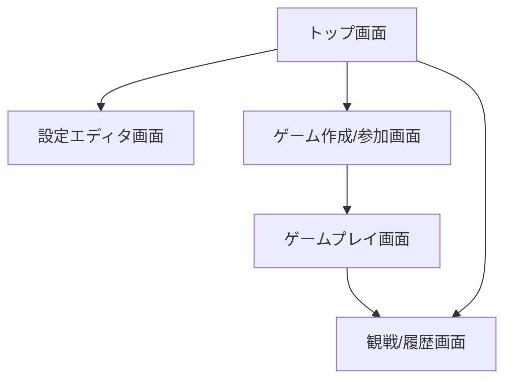

# UIデザイン指示書

## 目的
本ドキュメントは、FlexiBoardのUIデザインを担当するデザイナー向けの指示書です。下記の要件・仕様・方針に従い、ユーザー体験と実装容易性を両立したWeb UIデザインを作成してください。

---

## 1. 対象ページ一覧

1. トップ画面
2. 設定エディタ画面
3. ゲーム作成/参加画面
4. ゲームプレイ画面
5. 観戦/履歴画面

---

## 2. 各ページの要件・UI要素

### 1. トップ画面
- 目的: ユーザーの入口、主要機能へのナビゲーション
- 必須UI要素:
  - サービスロゴ/タイトル
  - 「新規作成」「参加」「履歴/観戦」ボタン
  - サポート情報・バージョン表示
- デザイン方針:
  - シンプルかつ直感的なレイアウト
  - 主要機能への導線を明確に
  - ブランドイメージを意識

### 2. 設定エディタ画面
- 目的: 盤面・コマ・ルールのYAML編集とプレビュー
- 必須UI要素:
  - 盤面形状選択ドロップダウン
  - board.yaml, pieces.yaml, rules.yamlエディタ（タブ切替可）
  - プレビュー盤面表示
  - バリデーション結果表示
  - 保存/インポート/エクスポートボタン
- デザイン方針:
  - YAMLエディタは視認性・操作性重視（シンタックスハイライト推奨）
  - プレビュー盤面は即時反映
  - エラー表示は目立つ色で明確に

### 3. ゲーム作成/参加画面
- 目的: ゲームルームの新規作成・既存ルーム参加
- 必須UI要素:
  - ゲームID入力欄
  - 設定ファイル選択/アップロード
  - 参加者リスト・待機表示
  - 「作成」「参加」ボタン
- デザイン方針:
  - 入力欄・ボタンは大きめで操作しやすく
  - 参加者待機中の状態が分かりやすい表示
  - エラー時の案内を明確に

### 4. ゲームプレイ画面
- 目的: 実際の対局・操作
- 必須UI要素:
  - 盤面グリッド表示
  - コマ操作（ドラッグ/クリック）
  - ターン表示
  - チャット欄
  - 履歴/巻き戻し/やり直しボタン
  - 勝敗・進行状況表示
- デザイン方針:
  - 盤面・コマは視認性・操作性重視
  - ターンや進行状況は常時明示
  - チャット欄は盤面と干渉しない配置
  - エラー・警告は即時表示

### 5. 観戦/履歴画面
- 目的: 他人の対局観戦・過去ゲームのリプレイ
- 必須UI要素:
  - 盤面遷移再生コントロール
  - 進行状況表示
  - 観戦者リスト
- デザイン方針:
  - 再生コントロールは直感的なアイコンで
  - 観戦者リストは分かりやすく
  - 状況・ターン表示は常時明示

---

## 3. 共通デザイン要件
- 日本語UI（フォントは可読性重視）
- レスポンシブデザイン（PC/タブレット/スマホ対応）
- 主要ブラウザ（Chrome, Edge, Firefox, Safari）対応
- アクセシビリティ配慮（色覚バリアフリー、キーボード操作、コントラスト等）
- エラーメッセージは全画面で明確に表示
- ブランドカラー・ロゴ等は別途資料を参照

---

## 4. 参考レイアウト・画面遷移例

---

## 5. 注意事項・補足
- 画面遷移・状態遷移・エラー時の挙動は要件仕様書（01_requirements.md）も参照
- 機能・UI要素の追加提案や改善案があれば歓迎
- デザイン案はワイヤーフレーム・モックアップ等で提出してください
- 不明点は必ずプロジェクト担当者に確認してください

--- 