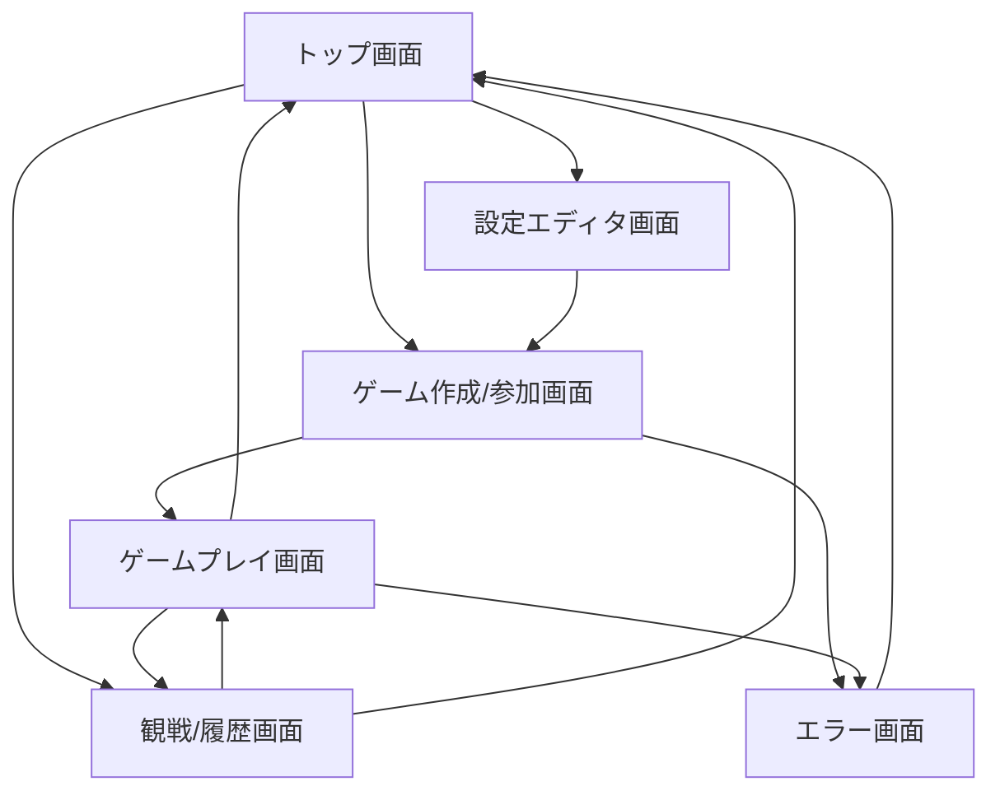
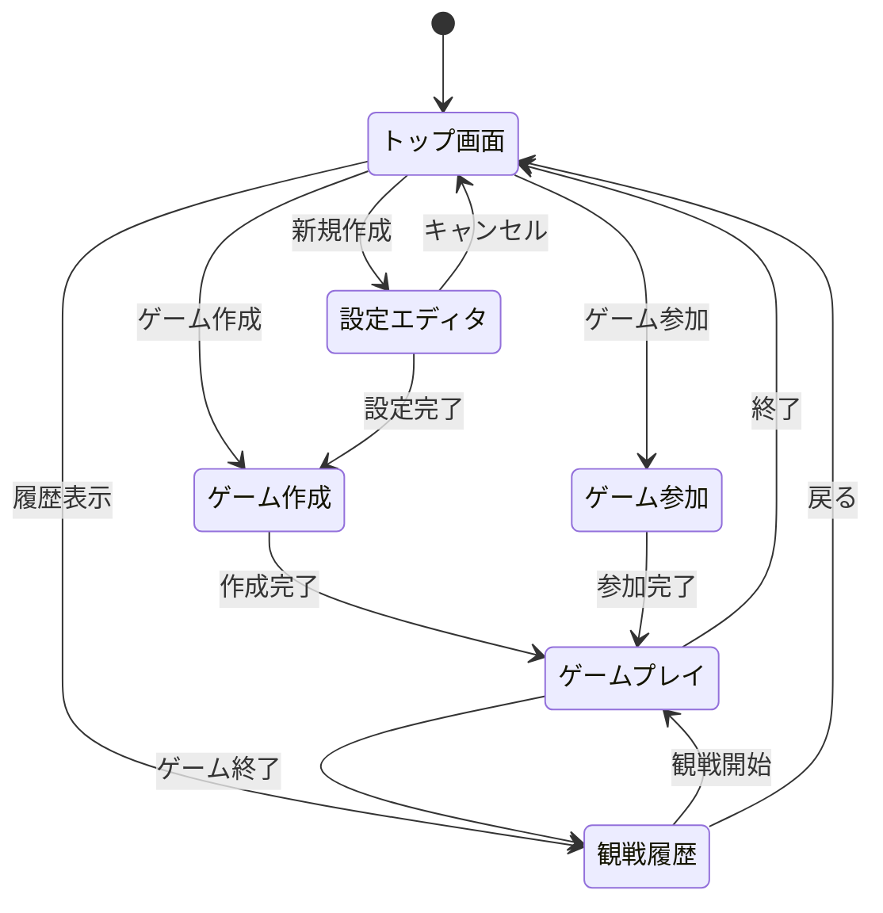

# UI設計指示書

## 文書情報
- **文書名**: FlexiBoard UI設計指示書
- **バージョン**: 1.0
- **作成日**: 2025年7月25日
- **最終更新日**: 2025年7月25日
- **作成者**: 開発チーム
- **承認者**: [承認者名]
- **承認日**: [承認日]

## 変更履歴
| バージョン | 日付 | 変更内容 | 変更者 |
|------------|------|----------|--------|
| 1.0 | 2025-07-25 | 初版作成 | 開発チーム |

---

## 1. プロジェクト概要

### 1.1 プロジェクト名
FlexiBoard（フレキシボード）

### 1.2 システム概要
本システムは、ユーザーが自由にルールを設定し、矩形盤面またはクアッドスフィア盤面でボードゲームを作成・プレイできるWebプラットフォームである。

### 1.3 UI設計の目的
- 直感的で使いやすいユーザーインターフェースの提供
- 設定編集からゲームプレイまで一貫したUXの実現
- アクセシビリティとレスポンシブデザインの確保
- エラー状態の適切な表示とユーザーガイダンス

### 1.4 設計方針
- **ユーザビリティ**: 直感的で学習コストの低い操作
- **一貫性**: 全画面で統一されたデザインシステム
- **アクセシビリティ**: 多様なユーザーに対応した設計
- **レスポンシブ**: 様々なデバイス・画面サイズへの対応

---

## 2. 用語・略語定義
- **UI**: User Interface（ユーザーインターフェース）
- **UX**: User Experience（ユーザーエクスペリエンス）
- **レスポンシブデザイン**: 画面サイズに応じて自動調整されるデザイン
- **アクセシビリティ**: 障害者を含む多様なユーザーが利用できる設計
- **ワイヤーフレーム**: UIの骨組みを示す設計図
- **モックアップ**: 実際の見た目に近いデザイン案
- **プロトタイプ**: 動作確認用の試作品

---

## 3. リスク分析
| リスク項目 | 影響度 | 発生確率 | 対策 |
|------------|--------|----------|------|
| 複雑なUIによる操作性低下 | 高 | 中 | ユーザビリティテスト・段階的改善 |
| レスポンシブ対応の不備 | 高 | 中 | 多デバイステスト・ブレークポイント設定 |
| アクセシビリティ要件の未達 | 高 | 低 | WCAG準拠・アクセシビリティテスト |
| ブラウザ互換性問題 | 中 | 中 | クロスブラウザテスト・ポリフィル対応 |
| パフォーマンス劣化 | 中 | 低 | 最適化・パフォーマンステスト |

---

## 4. 対象ページ一覧

### 4.1 主要ページ
1. **トップ画面** - システムの入り口、主要機能へのナビゲーション
2. **設定エディタ画面** - YAML設定ファイルの編集・プレビュー
3. **ゲーム作成/参加画面** - ゲームルームの作成・参加
4. **ゲームプレイ画面** - 実際のゲーム進行・操作
5. **観戦/履歴画面** - ゲーム観戦・履歴再生

### 4.2 補助ページ
- **エラー画面** - エラー発生時の表示
- **ヘルプ画面** - 操作方法・ルール説明
- **設定画面** - ユーザー設定・環境設定

---

## 5. 各ページの要件・UI要素

### 5.1 トップ画面

#### 5.1.1 機能要件
- システムロゴ・タイトル表示
- 主要機能へのナビゲーション
- 最近のゲーム履歴表示（オプション）
- システム情報・バージョン表示

#### 5.1.2 UI要素
| 要素 | 種類 | 配置 | 機能 |
|------|------|------|------|
| ヘッダー | 固定 | 上部 | ロゴ・タイトル・メニュー |
| メインナビゲーション | ボタン群 | 中央 | 新規作成・参加・履歴 |
| 最近のゲーム | リスト | 右側 | 最近プレイしたゲーム |
| フッター | 固定 | 下部 | バージョン・リンク |

#### 5.1.3 レイアウト例
```
┌─────────────────────────────────────┐
│ ヘッダー: FlexiBoard ロゴ・メニュー    │
├─────────────────────────────────────┤
│                                     │
│    [新規ゲーム作成] [ゲームに参加]      │
│                                     │
│    [履歴・観戦] [設定エディタ]         │
│                                     │
├─────────────────────────────────────┤
│ 最近のゲーム: [ゲーム1] [ゲーム2] ...  │
└─────────────────────────────────────┘
```

### 5.2 設定エディタ画面

#### 5.2.1 機能要件
- YAMLファイルの編集機能
- リアルタイムプレビュー
- バリデーション結果表示
- 設定の保存・読み込み・エクスポート

#### 5.2.2 UI要素
| 要素 | 種類 | 配置 | 機能 |
|------|------|------|------|
| ファイル選択 | ドロップダウン | 上部 | 編集対象ファイル選択 |
| YAMLエディタ | テキストエリア | 左側 | 設定ファイル編集 |
| プレビュー盤面 | グリッド | 右側 | 設定内容の視覚化 |
| バリデーション結果 | パネル | 下部 | エラー・警告表示 |
| 操作ボタン | ボタン群 | 下部 | 保存・読み込み・エクスポート |

#### 5.2.3 レイアウト例
```
┌─────────────────────────────────────┐
│ [board.yaml ▼] [保存] [読み込み] [エクスポート] │
├─────────────────┬───────────────────┤
│                 │                   │
│   YAMLエディタ   │   プレビュー盤面    │
│                 │                   │
│                 │                   │
├─────────────────┴───────────────────┤
│ バリデーション結果: [エラーなし] [警告: 2件] │
└─────────────────────────────────────┘
```

### 5.3 ゲーム作成/参加画面

#### 5.3.1 機能要件
- ゲームルーム作成
- 既存ゲームへの参加
- プレイヤー設定（人間/AI）
- ゲーム設定の確認

#### 5.3.2 UI要素
| 要素 | 種類 | 配置 | 機能 |
|------|------|------|------|
| ゲーム作成フォーム | フォーム | 左側 | 新規ゲーム作成 |
| 参加ゲームリスト | リスト | 右側 | 参加可能ゲーム一覧 |
| プレイヤー設定 | フォーム | 中央 | プレイヤー名・タイプ設定 |
| ゲーム情報表示 | パネル | 下部 | 選択ゲームの詳細 |

#### 5.3.3 レイアウト例
```
┌─────────────────────────────────────┐
│ ゲーム作成                   参加ゲーム │
├─────────────────┬───────────────────┤
│ ゲーム名: [_____] │ [ゲーム1] 2/4人    │
│ 盤面: [矩形 ▼]   │ [ゲーム2] 1/2人    │
│ ルール: [_____]  │ [ゲーム3] 3/4人    │
│                 │                   │
│ [ゲーム作成]     │                   │
├─────────────────┴───────────────────┤
│ プレイヤー設定: [名前] [人間/AI ▼] [参加] │
└─────────────────────────────────────┘
```

### 5.4 ゲームプレイ画面

#### 5.4.1 機能要件
- 盤面表示・操作
- コマの移動・選択
- ターン表示・管理
- チャット・履歴表示
- ゲーム操作（巻き戻し・やり直し）

#### 5.4.2 UI要素
| 要素 | 種類 | 配置 | 機能 |
|------|------|------|------|
| 盤面グリッド | グリッド | 中央 | ゲーム盤面表示・操作 |
| コマ | ドラッグ可能 | 盤面上 | 移動・選択 |
| ターン表示 | パネル | 上部 | 現在のプレイヤー表示 |
| 操作パネル | ボタン群 | 右側 | 巻き戻し・やり直し・設定 |
| チャット | テキストエリア | 下部 | プレイヤー間通信 |
| 履歴 | リスト | 左側 | 手番履歴表示 |

#### 5.4.3 レイアウト例
```
┌─────────────────────────────────────┐
│ ターン: プレイヤー1 [巻き戻し] [やり直し] │
├─────────┬─────────────┬─────────────┤
│         │             │             │
│ 履歴    │   盤面      │ 操作パネル   │
│         │             │             │
│ [手1]   │   □□□□□   │ [設定]      │
│ [手2]   │   □□□□□   │ [観戦]      │
│ [手3]   │   □□□□□   │ [終了]      │
├─────────┴─────────────┴─────────────┤
│ チャット: [メッセージ入力] [送信]      │
└─────────────────────────────────────┘
```

### 5.5 観戦/履歴画面

#### 5.5.1 機能要件
- ゲーム履歴の再生
- 観戦機能
- 進行状況表示
- コントロール機能

#### 5.5.2 UI要素
| 要素 | 種類 | 配置 | 機能 |
|------|------|------|------|
| 盤面表示 | グリッド | 中央 | ゲーム状態表示 |
| 再生コントロール | ボタン群 | 下部 | 再生・停止・巻き戻し |
| 進行状況 | スライダー | 下部 | 手番位置表示・操作 |
| 観戦者リスト | リスト | 右側 | 観戦者表示 |
| ゲーム情報 | パネル | 上部 | ゲーム詳細情報 |

#### 5.5.3 レイアウト例
```
┌─────────────────────────────────────┐
│ ゲーム情報: [ゲーム名] [プレイヤー] [結果] │
├─────────────────┬───────────────────┤
│                 │                   │
│   盤面表示      │   観戦者リスト     │
│                 │                   │
│                 │ [観戦者1]         │
│                 │ [観戦者2]         │
├─────────────────┴───────────────────┤
│ [◀] [再生] [停止] [▶] [手番: 15/30] │
└─────────────────────────────────────┘
```

---

## 6. 共通設計要件

### 6.1 デザイン要件
- **言語**: 日本語UI（将来的に多言語対応）
- **カラーパレット**: 統一されたカラーテーマ
- **フォント**: 読みやすい日本語フォント
- **アイコン**: 直感的で統一されたアイコンセット

### 6.2 レスポンシブ要件
- **デスクトップ**: 1024px以上
- **タブレット**: 768px-1023px
- **モバイル**: 320px-767px
- **対応ブラウザ**: Chrome, Firefox, Safari, Edge（最新版）

### 6.3 アクセシビリティ要件
- **キーボード操作**: すべての機能をキーボードで操作可能
- **スクリーンリーダー**: 適切なaria属性・alt属性
- **色覚対応**: 色だけでなく形状でも情報を表現
- **フォントサイズ**: ブラウザ設定に応じた拡大縮小対応

### 6.4 エラーメッセージ要件
- **明確性**: 何が問題で、どう修正すべきかを明確に表示
- **視認性**: エラー状態を視覚的に分かりやすく表示
- **操作性**: エラー修正のための具体的な操作案内
- **一貫性**: 全画面で統一されたエラー表示形式

---

## 7. 画面遷移図

### 7.1 主要画面遷移


### 7.2 詳細遷移フロー


---

## 8. 技術仕様

### 8.1 フロントエンド技術
- **HTML5**: セマンティックなマークアップ
- **CSS3**: モダンなスタイリング・アニメーション
- **JavaScript (ES6+)**: インタラクティブな機能実装
- **レスポンシブフレームワーク**: CSS Grid・Flexbox

### 8.2 ブラウザ対応
| ブラウザ | バージョン | 対応レベル |
|----------|------------|------------|
| Chrome | 90+ | 完全対応 |
| Firefox | 88+ | 完全対応 |
| Safari | 14+ | 完全対応 |
| Edge | 90+ | 完全対応 |

### 8.3 パフォーマンス要件
- **初期読み込み**: 3秒以内
- **画面遷移**: 1秒以内
- **操作応答**: 0.5秒以内
- **アニメーション**: 60fps維持

---

## 9. テスト要件

### 9.1 ユーザビリティテスト
- **対象**: 5-10名のテストユーザー
- **内容**: 主要機能の操作・フィードバック収集
- **評価項目**: 操作性・理解しやすさ・満足度

### 9.2 アクセシビリティテスト
- **スクリーンリーダー**: NVDA・JAWSでの動作確認
- **キーボード操作**: すべての機能のキーボード操作確認
- **色覚テスト**: 色覚異常者向けの視認性確認

### 9.3 レスポンシブテスト
- **デバイス**: デスクトップ・タブレット・スマートフォン
- **ブラウザ**: 各ブラウザでの表示・動作確認
- **画面サイズ**: 主要なブレークポイントでの確認

---

## 10. 承認

| 役割 | 氏名 | 署名 | 日付 |
|------|------|------|------|
| プロジェクトマネージャー | [氏名] | [署名] | [日付] |
| UI/UXデザイナー | [氏名] | [署名] | [日付] |
| フロントエンド開発者 | [氏名] | [署名] | [日付] |

--- 