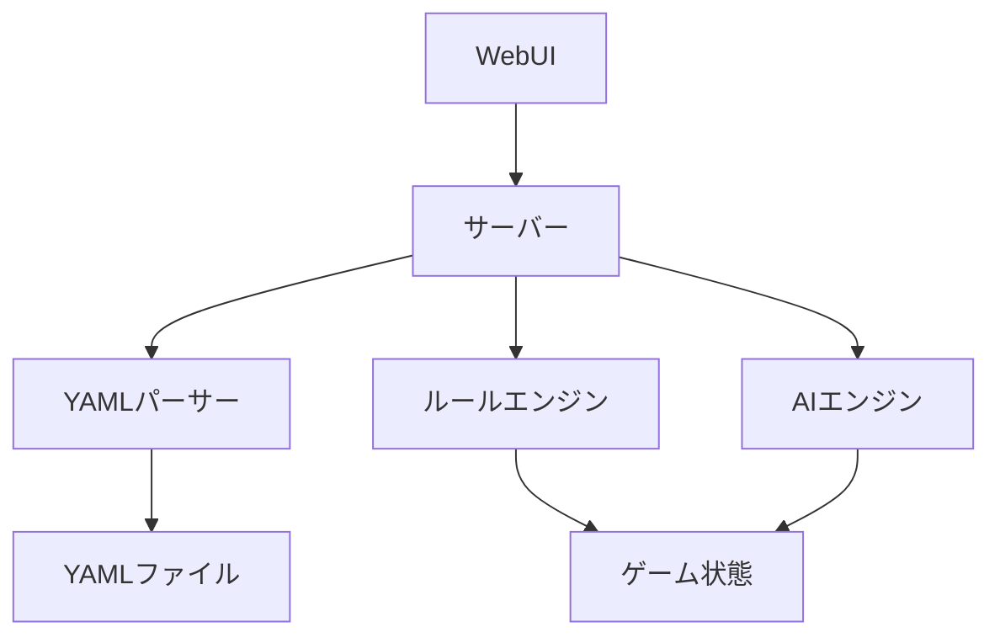
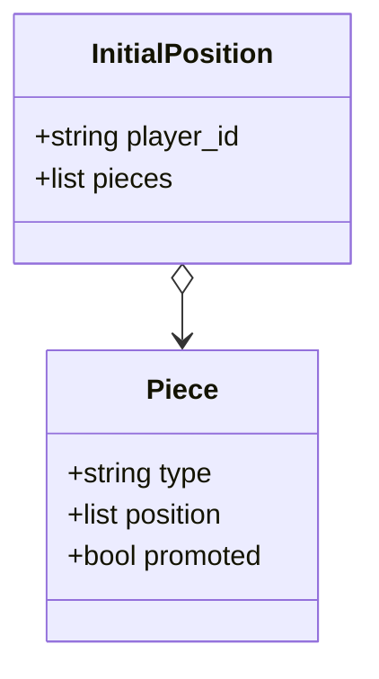
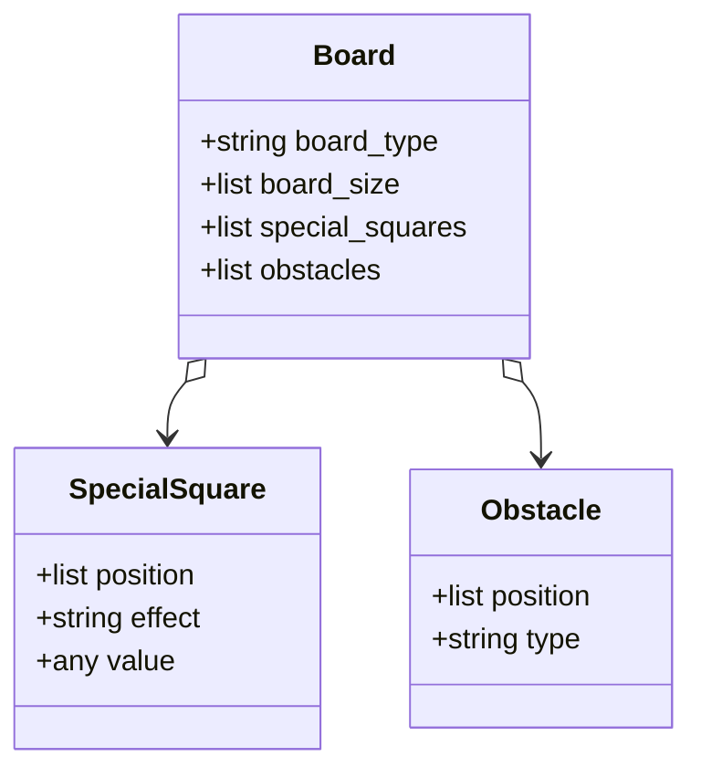
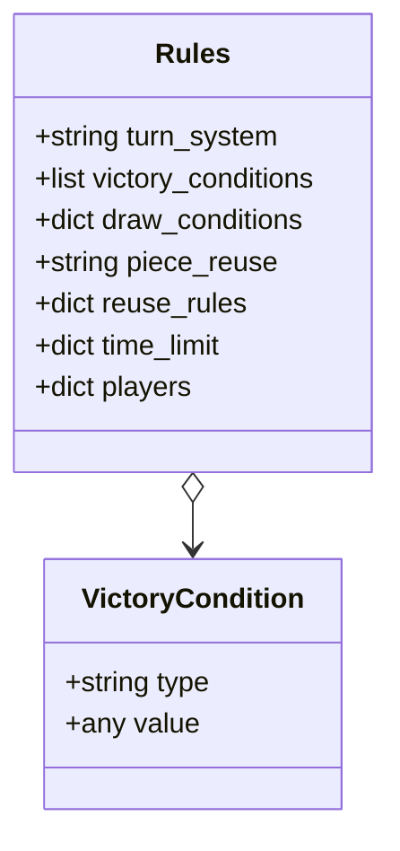
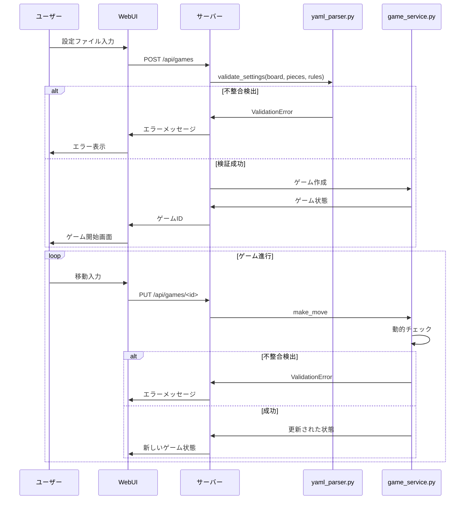

# 仕様書：ボードゲームプラットフォーム

**バージョン**: 0.1
**最終更新日**: 2025年7月3日

## 1. システムの概要
本システムは、ユーザーが自由にルールを設定してターン制のボードゲームを作成・プレイできるプラットフォームです。矩形盤面（伝統的なグリッド型）またはクアッドスフィア盤面（球面を模した特殊な接続を持つ盤面）を選択でき、ユーザーは盤面の形状、コマの動き、勝利条件などをYAMLファイルで設定し、WebUIを通じて直感的にゲームをプレイできます。

## 2. 主な機能
- **自由なルール設定**: 盤面、コマ、ルールをユーザーが自由に定義可能。
- **盤面の形状選択**: 「矩形（rectangular）」または「クアッドスフィア（quadsphere）」を選択可能。
- **YAMLファイルによる設定管理**: シンプルで構造化された形式でゲーム設定を管理。
- **WebUIによる操作**: ブラウザ上で直感的な操作を提供。
- **マルチプレイヤー対応**: 最大4人でのリアルタイム対戦。
- **AI対戦**: ミニマックス法やモンテカルロ木探索を活用したAIプレイヤー。

## 3. システムアーキテクチャ
クライアントサーバー型アーキテクチャを採用し、以下で構成されます：
- **クライアント**: WebUI（HTML, CSS, JavaScript）でユーザーインターフェースを提供。
- **サーバー**: Python（Flask）でゲームロジックや状態管理を担当。
- **通信**: WebSocket（Flask-SocketIO）でリアルタイム通信を実現。



## 4. 設定ファイルの構造
設定ファイルは以下の3つのYAMLファイルに分割されます：
- **`board.yaml`**: 盤面の形状やサイズを定義。
- **`pieces.yaml`**: コマの種類や動き方を定義。
- **`rules.yaml`**: ゲームのルールや勝利条件を定義。

### 4.1 `board.yaml`（盤面の設定）
- **概要**: 盤面の形状、サイズ、特殊マスを定義します。
- **設定項目**:
  - `board_type`: 盤面の形状（`"rectangular"` または `"quadsphere"`）。
  - `board_size`: 縦×横のマス数（例: `[8, 8]`）。
  - `special_squares`: 特殊マスのリスト（例: `[{"position": [3, 3], "effect": "teleport", "target": [5, 5]}]`）。
  - `obstacles`: 障害物のリスト（例: `[{"position": [2, 2], "type": "mountain"}]`）。

- **矩形盤面の例**:
  ```yaml
  board_type: "rectangular"
  board_size: [8, 8]
  special_squares:
    - position: [4, 4]
      effect: "damage"
      value: 1
  obstacles:
    - position: [3, 3]
      type: "river"
  ```

- **クアッドスフィア盤面の例**:
  ```yaml
  board_type: "quadsphere"
  board_size: [8, 8]
  ```

#### クアッドスフィア盤面の特徴
- **概要**: クアッドスフィアは、球面を四角形で近似した構造を採用し、2Dボードゲームでは盤面の端が反対側に接続されるトーラス（ドーナツ型）のような挙動を持ちます。
- **実装**: 盤面の端を越える移動が可能（例: 左端から左に移動すると右端に現れる）。座標はモジュロ演算で処理されます（`x = x % board_size[0]`）。

### 4.2 `pieces.yaml`（コマの設定）
- **概要**: コマの種類、動き方、初期配置を定義します。
- **設定項目**:
  - `piece_types`: コマの種類ごとの定義。
    - `name`: コマの名前（例: `"king"`）。
    - `movement`: 移動ルール（例: `"forward_1"`）。
    - `special_moves`: 特殊移動（例: `"jump"`）。
  - `initial_positions`: プレイヤーごとの初期配置。

- **例**:
  ```yaml
  piece_types:
    - name: "king"
      movement: "adjacent"
      special_moves: []
  initial_positions:
    player_1:
      - type: "king"
        position: [0, 4]
    player_2:
      - type: "king"
        position: [7, 4]
  ```

### 4.3 `rules.yaml`（ルールの設定）
- **概要**: ゲームの進行ルールや勝利条件を定義します。
- **設定項目**:
  - `turn_system`: ターンの進め方（例: `"alternate"`）。
  - `victory_conditions`: 勝利条件（例: `["capture_king"]`）。
  - `time_limit`: 時間制限（例: `{"per_move": 30}`）。

- **例**:
  ```yaml
  turn_system: "alternate"
  victory_conditions:
    - "capture_king"
  time_limit:
    per_move: 60
  ```

## 5. ユーザーインターフェース（WebUI）
- **ゲーム設定画面**:
  - **盤面形状選択**: ドロップダウンメニューで「矩形」または「クアッドスフィア」を選択。
  - YAMLエディタ: 設定を編集可能。
  - プレビュー: 設定をリアルタイムで盤面に反映。
- **ゲーム画面**:
  - 盤面表示: 矩形はグリッド、クアッドスフィアは端の接続を示す視覚的補助付き。
  - コマ操作: クリックで移動。

## 6. バックエンドの詳細設計

### 6.1 モデル
- **`Board`クラス**:
  - **属性**:
    - `type`: `"rectangular"` または `"quadsphere"`
    - `size`: 盤面サイズ（例: `[8, 8]`）
  - **メソッド**:
    - `get_square(x, y)`: クアッドスフィアの場合、座標を正規化（`x % size[0]`）。
    - `move_piece(from_x, from_y, to_x, to_y)`: 盤面形状に応じた移動処理。

### 6.2 サービス
- **`game_service.py`**:
  - `make_move(game_id, move)`: 矩形では単純移動、クアッドスフィアでは端を越える移動を処理。

## 7. 実装のポイント
- **矩形盤面**: 標準的なグリッド構造。移動は盤面内で制限。
- **クアッドスフィア盤面**: 端を越える移動をモジュロ演算で実現し、UIで接続を視覚化（例: 矢印表示）。
- **互換性**: コマの移動ルールや勝利条件は盤面形状に応じて適用。

## 8. テスト計画
- **ユニットテスト**:
  - 矩形盤面での移動。
  - クアッドスフィア盤面での端を越える移動。
- **UIテスト**:
  - 盤面形状の選択とプレビュー。

## 9. まとめ
本仕様書では、矩形とクアッドスフィアの盤面を選択可能にし、それぞれの特徴を明確に定義しました。ユーザーは設定ファイルやUIを通じて簡単に形状を選択でき、新しいゲーム体験を実現できます。開発者はこの仕様を基に実装を進めてください。

---

## 1. `pieces.yaml`の仕様概要
`pieces.yaml`は、ボードゲームプラットフォームにおけるコマ（ピース）の設定を定義するファイルです。以下の情報を含みます：
- **コマの種類（`piece_types`）**: 各コマの名前、移動ルール、特殊ルール、成り（プロモーション）ルールを定義。
- **初期配置（`initial_positions`）**: プレイヤーごとのコマの配置を指定。

このファイルは他の設定ファイル（`board.yaml`、`rules.yaml`）と独立しており、任意のゲームに対応できるよう柔軟に設計されています。特に、矩形盤面とクアッドスフィア盤面の両方に対応します。

---

## 2. `piece_types`の詳細仕様
`piece_types`は、ゲームで使用されるすべてのコマの種類を定義するリストです。各コマは以下の属性を持ちます。

### 2.1 属性
- **`name`**: コマの名前（文字列、必須）。ゲーム内でユニークである必要あり。
  - 例: `"king"`, `"pawn"`, `"rook"`
- **`movement`**: 移動ルールを定義（必須）。以下のいずれかの形式で記述：
  - **相対座標形式**: 移動可能な座標のリスト（例: `[(1, 0), (-1, 0)]`で上下1マス移動）。
  - **パターン形式**: 定義済みの移動パターン（例: `"horizontal_vertical_unlimited"`）。
- **`special_moves`**: 特殊な移動ルール（オプション）。リスト形式で指定。
  - 例: `["jump", "initial_double_step"]`
- **`promotion`**: 成りルール（オプション）。以下の属性を持つ：
  - `zone`: 成り可能なエリア（例: `"enemy_back_row"`）。
  - `new_type`: 成った後のコマの種類（例: `"queen"`）。

### 2.2 `movement`の記述方法
移動ルールは、ゲームの柔軟性を確保するため、2つの形式をサポートします。

#### 2.2.1 相対座標形式
- **説明**: 現在の位置からの相対座標で移動可能なマスを指定。
- **形式**: `[x, y]`のリスト（`x`は横移動、`y`は縦移動）。
- **例**:
  - 上下左右1マス: `[(1, 0), (-1, 0), (0, 1), (0, -1)]`
  - 前方1マス: `[(0, 1)]`

#### 2.2.2 パターン形式
- **説明**: 一般的な移動パターンを文字列で指定。
- **可能な値**:
  - `"adjacent"`: 上下左右および斜めの隣接マス（8方向、チェスのキング相当）。
  - `"horizontal_vertical_unlimited"`: 水平・垂直方向に無制限（チェスのルーク相当）。
  - `"diagonal_unlimited"`: 斜め方向に無制限（チェスのビショップ相当）。
  - `"knight"`: ナイトのL字型移動（チェスのナイト相当）。
  - `"forward_1"`: 前方1マス（将棋の歩兵相当）。
  - `"custom"`: ユーザー定義の複雑なルール（スクリプト記述が必要）。

### 2.3 `special_moves`の可能な値
- **`"jump"`**: 他のコマを飛び越え可能。
- **`"initial_double_step"`**: 初期位置からのみ2マス移動可能（チェスのポーン相当）。
- **`"capture_only"`**: 移動先で敵のコマを捕獲する場合のみ移動可能。
- **`"castling"`**: キャスリング（チェスのキングとルークの特殊移動）。

### 2.4 `promotion`の詳細
- **zone**: 成り可能なエリア。
  - 可能な値:
    - `"enemy_back_row"`: 敵陣の最終行（チェスのポーン相当）。
    - `"enemy_territory"`: 敵陣全体（将棋の3段目相当）。
    - `"specific_square"`: 特定のマス（例: `[4, 4]`）。
- **new_type**: 成った後のコマの種類（`piece_types`で定義済みの`name`）。

### 2.5 `piece_types`の構造図
```mermaid
classDiagram
    class PieceType {
        +string name
        +list movement
        +list special_moves
        +dict promotion
    }
    PieceType : +name: "king"
    PieceType : +movement: [(1,0), (-1,0)]
    PieceType : +special_moves: ["castling"]
    PieceType : +promotion: {zone: "enemy_back_row", new_type: "queen"}
```

## 3. `initial_positions`の詳細仕様
- **概要**: 各プレイヤーのコマの初期配置を定義。
- **構造**: プレイヤーID（例: `player_1`, `player_2`）をキーとし、配置するコマのリストを値とする。
- **属性**:
  - `type`: コマの種類（`piece_types`の`name`と一致）。
  - `position`: 配置位置（`[x, y]`形式）。
  - `promoted`: 初期状態で成っているか（`true`/`false`、デフォルトは`false`）。

### 3.6 構造図


## 4. 将棋を例にした`pieces.yaml`の具体例
将棋（9×9盤、標準ルール）を再現する`pieces.yaml`の例を示します。

```yaml
piece_types:
  - name: "king"
    movement: "adjacent"
    special_moves: []
    promotion: null
  - name: "rook"
    movement: "horizontal_vertical_unlimited"
    special_moves: []
    promotion:
      zone: "enemy_territory"
      new_type: "promoted_rook"
  - name: "promoted_rook"
    movement: ["horizontal_vertical_unlimited", (1, 0), (-1, 0), (0, 1), (0, -1)]
    special_moves: []
    promotion: null
  - name: "pawn"
    movement: "forward_1"
    special_moves: []
    promotion:
      zone: "enemy_territory"
      new_type: "promoted_pawn"
  - name: "promoted_pawn"
    movement: "adjacent"
    special_moves: []
    promotion: null
initial_positions:
  player_1:
    - type: "king"
      position: [4, 8]
      promoted: false
    - type: "rook"
      position: [1, 7]
      promoted: false
    - type: "pawn"
      position: [0, 6]
      promoted: false
    - type: "pawn"
      position: [1, 6]
      promoted: false
    # 他のコマも同様に配置
  player_2:
    - type: "king"
      position: [4, 0]
      promoted: false
    - type: "rook"
      position: [7, 1]
      promoted: false
    - type: "pawn"
      position: [0, 2]
      promoted: false
    - type: "pawn"
      position: [1, 2]
      promoted: false
    # 他のコマも同様に配置
```

### 4.1 将棋の設定のポイント
- **コマの種類**: 将棋の「王将」「飛車」「歩兵」などを定義。成り後の状態（例: 「成飛車」）も別タイプとして定義。
- **移動ルール**:
  - 王将: `"adjacent"`で8方向1マス移動。
  - 飛車: `"horizontal_vertical_unlimited"`で水平・垂直に無制限移動。
  - 歩兵: `"forward_1"`で前方1マス移動。
- **成りルール**: `enemy_territory`（敵陣3段目）で成り可能。
- **初期配置**: 将棋の標準配置を再現（例: 王将は中央、飛車は2列目）。

## 5. クアッドスフィア盤面への対応
クアッドスフィア盤面では、盤面の端が反対側に接続されるため、移動ルールの座標計算がモジュロ演算（`x % board_size[0]`）で処理されます。`piece_types`の移動ルールは矩形盤面と同じ形式で記述可能ですが、システムが盤面形状に応じて適切に解釈します。

### 5.1 クアッドスフィア向けの例
```yaml
piece_types:
  - name: "explorer"
    movement: "horizontal_vertical_unlimited"
    special_moves: ["jump"]
    promotion: null
initial_positions:
  player_1:
    - type: "explorer"
      position: [0, 0]
      promoted: false
  player_2:
    - type: "explorer"
      position: [7, 7]
      promoted: false
```

- **ポイント**: `horizontal_vertical_unlimited`はクアッドスフィア盤面で端を越えて移動可能。`jump`により他のコマを飛び越える。

## 6. 実装時の注意点
- **バリデーション**:
  - `name`はユニークであることを確認。
  - `movement`の値が有効（相対座標またはパターン）かチェック。
  - `initial_positions`の座標が盤面サイズ内か検証（矩形の場合）。クアッドスフィアではモジュロ処理で自動調整。
- **エラーメッセージ**: 不正な設定（例: 存在しない`new_type`）に対し、明確なエラーを返す。
- **デフォルト値**: `special_moves`や`promotion`が未定義の場合、空リストまたは`null`を適用。

## 7. ユーザーインターフェースでのサポート
WebUIでは、以下を提供：
- **移動ルールエディタ**: ドロップダウンでパターン形式を選択、または座標を入力。
- **初期配置エディタ**: 盤面をクリックしてコマを配置。
- **プレビュー**: 設定した移動ルールや配置を盤面上で視覚化。

## 8. まとめ
この`pieces.yaml`の仕様では、コマの種類、移動ルール、特殊ルール、成りルール、初期配置を詳細に定義しました。将棋の例を通じて、実際のゲーム設定を再現する方法を具体的に示し、クアッドスフィア盤面への対応も明確化しました。これにより、開発者は設定ファイルの構造を正確に理解し、実装を進められます。追加の例や特定のゲームの設定が必要な場合は、お知らせください！

---


## 1. `board.yaml`の仕様概要
`board.yaml`は、ゲーム盤面の形状、サイズ、特殊マス、障害物を定義するファイルです。このファイルはゲームの空間的構造を決定し、矩形盤面（標準的なグリッド型）またはクアッドスフィア盤面（球面を模した端が接続された構造）をサポートします。`pieces.yaml`や`rules.yaml`と独立しており、盤面形状の変更が他の設定に影響を与えないように設計されています。

### 1.1 属性
- **`board_type`**: 盤面の形状（必須）。
  - **可能な値**:
    - `"rectangular"`: 標準的なグリッド型盤面（例: チェスや将棋）。
    - `"quadsphere"`: 端が反対側に接続される球面近似盤面（トーラス型）。
- **`board_size`**: 盤面のサイズ（必須）。`[width, height]`形式の整数リスト。
  - 例: `[8, 8]`（チェス）、`[9, 9]`（将棋）。
- **`special_squares`**: 特殊効果を持つマスのリスト（オプション）。
  - **属性**:
    - `position`: マスの座標（`[x, y]`形式）。
    - `effect`: 効果の種類（例: `"teleport"`, `"damage"`, `"bonus"`）。
    - `value`: 効果の値（例: テレポート先の座標、ダメージ量）。
  - **可能な`effect`の値**:
    - `"teleport"`: 指定位置に移動（`value`にテレポート先`[x, y]`を指定）。
    - `"damage"`: コマにダメージを与える（`value`にダメージ量）。
    - `"bonus"`: ポイントや移動力増加（`value`に増加量）。
    - `"block"`: 移動不可マス。
- **`obstacles`**: 障害物のリスト（オプション）。
  - **属性**:
    - `position`: 障害物の座標（`[x, y]`形式）。
    - `type`: 障害物の種類（例: `"mountain"`, `"river"`）。
  - **可能な`type`の値**:
    - `"mountain"`: 移動・通過不可。
    - `"river"`: 移動速度を半減（例: 移動コスト2倍）。
    - `"wall"`: 特定方向の移動を制限。

### 1.2 `board.yaml`の構造図


### 1.3 将棋を例にした`board.yaml`の具体例
将棋（9×9盤、標準ルール）を再現する`board.yaml`の例を示します。将棋では特殊マスや障害物は通常存在しないため、最小限の設定です。

```yaml
board_type: "rectangular"
board_size: [9, 9]
special_squares: []
obstacles: []
```

### 1.4 クアッドスフィア盤面の具体例
クアッドスフィア盤面を用いた例として、8×8の盤面に特殊マス（テレポート）と障害物（川）を配置した設定を示します。

```yaml
board_type: "quadsphere"
board_size: [8, 8]
special_squares:
  - position: [4, 4]
    effect: "teleport"
    value: [0, 0]
  - position: [5, 5]
    effect: "damage"
    value: 1
obstacles:
  - position: [3, 3]
    type: "river"
  - position: [3, 4]
    type: "river"
```

### 1.5 実装時の注意点
- **矩形盤面**:
  - 座標は`[0, board_size[0]-1]`と`[0, board_size[1]-1]`の範囲内に制限。
  - 移動は盤面境界で停止。
- **クアッドスフィア盤面**:
  - 座標はモジュロ演算で処理（例: `x = x % board_size[0]`）。
  - UIで端の接続を視覚化（例: 矢印やハイライトで接続を示す）。
- **バリデーション**:
  - `board_size`は正の整数ペアであること。
  - `special_squares`と`obstacles`の`position`が盤面サイズ内に収まる（矩形の場合）か、クアッドスフィアではモジュロで正規化可能か確認。
- **デフォルト値**:
  - `special_squares`と`obstacles`が未定義の場合、空リストを適用。

---

## 2. `rules.yaml`の仕様概要
`rules.yaml`は、ゲームの進行ルール、勝利条件、引き分け条件、時間制限、プレイヤー設定を定義するファイルです。ターン制ゲームに限定し、最大4人プレイとAI戦をサポートします。このファイルはゲームのロジックと勝敗判定の核となります。

### 2.1 属性
- **`turn_system`**: ターンの進め方（必須）。
  - **可能な値**:
    - `"alternate"`: プレイヤーが順番に行動（例: 将棋、チェス）。
- **`victory_conditions`**: 勝利条件のリスト（必須、少なくとも1つ）。
  - **可能な値**:
    - `"capture_king"`: 指定されたコマ（例: 王）を捕獲。
    - `"eliminate_all"`: 相手の全コマを排除。
    - `"control_center"`: 盤面中央の特定マス（例: 中央4マス）を占領。
    - `"reach_square"`: 特定マスに到達（`value`でマスを指定）。
    - `"score"`: ポイントを一定数獲得（`value`で目標ポイント）。
- **`draw_conditions`**: 引き分け条件（オプション）。
  - **属性**:
    - `max_turns`: 最大ターン数（例: 100）。
    - `repetition`: 同一局面の繰り返し回数（例: 3で千日手）。
- **`piece_reuse`**: 捕獲したコマの再利用（必須）。
  - **可能な値**:
    - `"on"`: 再利用可能（将棋の手駒相当）。
    - `"off"`: 再利用不可（チェス相当）。
  - **関連属性**:
    - `reuse_rules`: 再利用のルール（例: `"any_empty_square"`）。
- **`time_limit`**: 時間制限（オプション）。
  - **属性**:
    - `total_time`: プレイヤーごとの合計持ち時間（秒）。
    - `per_move`: 1手ごとの制限時間（秒）。
- **`players`**: プレイヤー設定（必須）。
  - **属性**:
    - `number`: プレイヤー数（1～4）。
    - `teams`: チーム戦か（`true`/`false`）。
    - `ai_difficulty`: AIの難易度（例: `"easy"`, `"medium"`, `"hard"`）。

### 2.2 `rules.yaml`の構造図


### 2.3 将棋を例にした`rules.yaml`の具体例
将棋（9×9盤、標準ルール）を再現する`rules.yaml`の例を示します。

```yaml
turn_system: "alternate"
victory_conditions:
  - type: "capture_king"
    value: "king" # 捕獲対象のコマ
draw_conditions:
  max_turns: 100
  repetition: 4 # 千日手
piece_reuse: "on"
reuse_rules:
  placement: "any_empty_square"
time_limit:
  total_time: 900 # 15分
  per_move: 30
players:
  number: 2
  teams: false
  ai_difficulty: null
```

### 2.4 クアッドスフィア盤面の具体例
クアッドスフィア盤面を用いたゲーム（4人プレイ、ポイント制）の例を示します。

```yaml
turn_system: "alternate"
victory_conditions:
  - type: "score"
    value: 10 # 10ポイントで勝利
  - type: "control_center"
    value: [[3, 3], [3, 4], [4, 3], [4, 4]] # 中央4マス
draw_conditions:
  max_turns: 50
piece_reuse: "off"
reuse_rules: null
time_limit:
  per_move: 60
players:
  number: 4
  teams: false
  ai_difficulty: "medium"
```

### 2.5 実装時の注意点
- **ターンシステム**:
  - `"alternate"`はプレイヤー順（1→2→3→4）を固定。
- **勝利条件**:
  - 複数条件をサポートし、最初に達成された条件でゲーム終了。
  - クアッドスフィアでは、`reach_square`のような条件で座標がモジュロで処理される。
- **バリデーション**:
  - `victory_conditions`に少なくとも1つの条件が必須。
  - `piece_reuse`が`"on"`の場合、`reuse_rules`が必須。
- **デフォルト値**:
  - `draw_conditions`未定義の場合、引き分けなし。
  - `time_limit`未定義の場合、時間無制限。

## 3. 実装のポイント
- **盤面形状の処理**:
  - 矩形: 座標範囲チェック（`0 ≤ x < board_size[0]`）。
  - クアッドスフィア: モジュロ演算で接続処理（`x = x % board_size[0]`）。
- **UIサポート**:
  - `board_type`選択時に、WebUIで盤面のプレビューを表示。
  - クアッドスフィアでは、端の接続を矢印や色で視覚化。
- **エラーハンドリング**:
  - 不正な座標や効果を検出し、明確なエラーメッセージを返す。
  - 例: `special_squares`の`position`が盤面外の場合、エラー。

## 4. 将棋全体の設定例
将棋の完全な設定例として、`board.yaml`、`rules.yaml`、`pieces.yaml`を統合した例を示します。

### `board.yaml`
```yaml
board_type: "rectangular"
board_size: [9, 9]
special_squares: []
obstacles: []
```

### `rules.yaml`
```yaml
turn_system: "alternate"
victory_conditions:
  - type: "capture_king"
    value: "king"
draw_conditions:
  repetition: 4
piece_reuse: "on"
reuse_rules:
  placement: "any_empty_square"
time_limit:
  total_time: 900
players:
  number: 2
  teams: false
  ai_difficulty: null
```

### `pieces.yaml`（簡略化）
```yaml
piece_types:
  - name: "king"
    movement: "adjacent"
    special_moves: []
    promotion: null
  - name: "rook"
    movement: "horizontal_vertical_unlimited"
    special_moves: []
    promotion:
      zone: "enemy_territory"
      new_type: "promoted_rook"
initial_positions:
  player_1:
    - type: "king"
      position: [4, 8]
    - type: "rook"
      position: [1, 7]
  player_2:
    - type: "king"
      position: [4, 0]
    - type: "rook"
      position: [7, 1]
```

## 5. まとめ
`board.yaml`と`rules.yaml`の仕様を詳細に定義し、将棋やクアッドスフィア盤面の具体例を提示しました。矩形とクアッドスフィアの両方に対応し、移動や勝利条件の処理が盤面形状に応じて適切に機能するよう設計しました。Mermaid図で構造を視覚化し、開発者が実装しやすい仕様を提供しました。追加の詳細や他のゲーム例が必要な場合、ぜひお知らせください！

---

## 1. パラメーター不整合の概要
パラメーターの不整合とは、設定ファイル（`board.yaml`、`pieces.yaml`、`rules.yaml`）間で矛盾する設定が存在する場合や、個々のファイル内で無効な値が設定されている場合を指します。不整合を検知しないと、ゲームの動作が不安定になったり、ランタイムエラーが発生したりします。チェックは主にゲーム開始時の設定読み込み時に行い、必要に応じてゲーム進行中にも動的チェックを実施します。

### 1.1 不整合の例
- `pieces.yaml`の`initial_positions`の座標が`board.yaml`の`board_size`を超える（矩形盤面の場合）。
- `rules.yaml`の`victory_conditions`で指定されたコマ（例: `"king"`）が`pieces.yaml`の`piece_types`に存在しない。
- `rules.yaml`の`piece_reuse: "on"`なのに、`reuse_rules`が未定義。
- `board.yaml`の`special_squares`の座標が盤面外（矩形盤面の場合）。

### 1.2 チェックの目的
- **ゲーム開始前のエラー検出**: 不正な設定をゲーム開始前に排除し、安定したゲーム環境を提供。
- **ユーザビリティ向上**: 明確なエラーメッセージでユーザーが設定を修正できるようにする。
- **システムの堅牢性**: ランタイムエラーを防ぎ、予期しない動作を回避。

---

## 2. 不整合を検知すべき箇所
不整合チェックは以下のタイミングとモジュールで行います。

### 2.1 主要なチェック箇所
- **場所**: バックエンドの`services/yaml_parser.py`内の`validate_settings`関数。
- **タイミング**: ゲーム作成時（`POST /api/games`エンドポイントの呼び出し時）に、すべての設定ファイル（`board.yaml`, `pieces.yaml`, `rules.yaml`）を読み込み、整合性を検証。
- **理由**: 設定ファイルは相互に関連しており、ゲーム開始前に一括でチェックすることで不整合を効率的に検出可能。

### 2.2 動的チェック箇所
- **場所**: `services/game_service.py`内のゲームロジック（例: `make_move`, `check_victory`）。
- **タイミング**: ゲーム進行中、移動や勝利条件の適用時に動的チェックを実施。
- **理由**: ユーザーの操作やゲーム状態の変化により、設定ファイルに基づくルールが正しく適用されているか確認する必要がある。

### 2.3 WebUIでの補助的チェック
- **場所**: フロントエンドの`SettingsEditor.js`。
- **タイミング**: ユーザーが設定を入力・編集する際、リアルタイムで簡易チェック。
- **理由**: ユーザーが不正な設定を送信する前に警告を表示し、UXを向上。

---

## 3. 不整合チェックの詳細仕様

以下に、各設定ファイル間およびファイル内での不整合チェックの仕様を定義します。チェックは主に`yaml_parser.py`の`validate_settings`関数で行い、必要に応じて`game_service.py`で動的チェックを補完します。

### 3.1 `board.yaml`に関する不整合チェック
#### チェック項目
1. **盤面サイズの有効性**:
   - `board_size`が`[width, height]`形式で、正の整数ペアであること。
   - エラー例: `board_size: [0, 9]`（0は無効）、`board_size: [8.5, 9]`（非整数）。
2. **盤面タイプの有効性**:
   - `board_type`が`"rectangular"`または`"quadsphere"`であること。
   - エラー例: `board_type: "hexagonal"`（未サポート）。
3. **特殊マスと障害物の座標**:
   - `special_squares`と`obstacles`の`position`が盤面サイズ内に収まる（矩形盤面の場合）。
   - クアッドスフィア盤面では、座標が整数であることのみ確認（モジュロ演算で正規化）。
   - エラー例: 矩形盤面で`board_size: [9, 9]`なのに`position: [10, 5]`。
4. **特殊マスの効果の有効性**:
   - `effect`がサポート済みの値（`"teleport"`, `"damage"`, `"bonus"`, `"block"`）であること。
   - `teleport`の場合、`value`が有効な座標であること。
   - エラー例: `effect: "invalid_effect"`、テレポート先が盤面外。

#### コード例（`yaml_parser.py`）
```python
def validate_board(board_data: Dict) -> None:
    """board.yamlの検証"""
    # board_typeのチェック
    board_type = board_data.get("board_type", "rectangular")
    if board_type not in ["rectangular", "quadsphere"]:
        raise ValidationError(f"Invalid board_type: {board_type}")

    # board_sizeのチェック
    board_size = board_data.get("board_size")
    if not isinstance(board_size, list) or len(board_size) != 2 or not all(isinstance(x, int) and x > 0 for x in board_size):
        raise ValidationError("Invalid board_size: Expected [width, height] with positive integers")

    width, height = board_size

    # special_squaresのチェック
    for square in board_data.get("special_squares", []):
        position = square.get("position")
        if not isinstance(position, list) or len(position) != 2 or not all(isinstance(x, int) for x in position):
            raise ValidationError(f"Invalid position in special_squares: {position}")
        if board_type == "rectangular" and not (0 <= position[0] < width and 0 <= position[1] < height):
            raise ValidationError(f"Position {position} out of bounds for board size {board_size}")
        if square.get("effect") not in ["teleport", "damage", "bonus", "block"]:
            raise ValidationError(f"Invalid effect in special_squares: {square.get('effect')}")
        if square.get("effect") == "teleport":
            value = square.get("value")
            if board_type == "rectangular" and not (isinstance(value, list) and len(value) == 2 and 0 <= value[0] < width and 0 <= value[1] < height):
                raise ValidationError(f"Invalid teleport target: {value}")

    # obstaclesのチェック（同様）
```

### 3.2 `pieces.yaml`に関する不整合チェック
#### チェック項目
1. **コマの種類のユニーク性**:
   - `piece_types`の`name`がユニークであること。
   - エラー例: 同一`name`（例: `"king"`）が複数定義。
2. **移動ルールの有効性**:
   - `movement`が相対座標形式（`[x, y]`のリスト）またはパターン形式（`"adjacent"`, `"horizontal_vertical_unlimited"`など）であること。
   - エラー例: `movement: "invalid_pattern"`
3. **成りルールの整合性**:
   - `promotion.new_type`が`piece_types`に存在すること。
   - `promotion.zone`が有効（`"enemy_back_row"`, `"enemy_territory"`, `"specific_square"`）。
   - エラー例: `new_type: "queen"`が`piece_types`に未定義。
4. **初期配置の座標**:
   - `initial_positions`の`position`が盤面サイズ内に収まる（矩形盤面の場合）。
   - クアッドスフィア盤面では整数チェックのみ。
   - 同一座標に複数のコマが配置されていないこと。
   - エラー例: `position: [10, 5]`（矩形、9×9盤面）、`position: [4, 4]`が重複。
5. **初期配置のコマタイプ**:
   - `initial_positions`の`type`が`piece_types`に存在すること。
   - エラー例: `type: "knight"`が`piece_types`に未定義。

#### コード例（`yaml_parser.py`）
```python
def validate_pieces(pieces_data: Dict, board_size: List[int], board_type: str) -> None:
    """pieces.yamlの検証"""
    width, height = board_size
    piece_types = pieces_data.get("piece_types", [])
    seen_names = set()
    
    # piece_typesのチェック
    for pt in piece_types:
        name = pt.get("name")
        if not name or name in seen_names:
            raise ValidationError(f"Duplicate or missing piece type name: {name}")
        seen_names.add(name)
        
        # movementのチェック
        movement = pt.get("movement")
        valid_patterns = ["adjacent", "horizontal_vertical_unlimited", "diagonal_unlimited", "knight", "forward_1", "custom"]
        if isinstance(movement, list):
            if not all(isinstance(m, list) and len(m) == 2 and all(isinstance(x, int) for x in m) for m in movement):
                raise ValidationError(f"Invalid movement coordinates for {name}: {movement}")
        elif movement not in valid_patterns:
            raise ValidationError(f"Invalid movement pattern for {name}: {movement}")
        
        # promotionのチェック
        if pt.get("promotion"):
            new_type = pt["promotion"].get("new_type")
            if new_type and not any(pt2["name"] == new_type for pt2 in piece_types):
                raise ValidationError(f"Unknown promotion new_type: {new_type}")
            zone = pt["promotion"].get("zone")
            if zone not in ["enemy_back_row", "enemy_territory", "specific_square"]:
                raise ValidationError(f"Invalid promotion zone: {zone}")

    # initial_positionsのチェック
    seen_positions = set()
    for player_id, pieces in pieces_data.get("initial_positions", {}).items():
        for piece in pieces:
            if piece.get("type") not in seen_names:
                raise ValidationError(f"Unknown piece type in initial_positions: {piece.get('type')}")
            position = piece.get("position")
            x, y = position
            if not (isinstance(x, int) and isinstance(y, int)):
                raise ValidationError(f"Non-integer position for piece {piece.get('type')}: {position}")
            if board_type == "rectangular" and not (0 <= x < width and 0 <= y < height):
                raise ValidationError(f"Position {position} out of bounds for board size {board_size}")
            pos_tuple = tuple(position)
            if pos_tuple in seen_positions:
                raise ValidationError(f"Duplicate position {position} found")
            seen_positions.add(pos_tuple)
```

### 3.3 `rules.yaml`に関する不整合チェック
#### チェック項目
1. **ターンシステムの有効性**:
   - `turn_system`が`"alternate"`であること。
   - エラー例: `turn_system: "simultaneous"`（未サポート）。
2. **勝利条件の整合性**:
   - `victory_conditions`の`type`が有効（`"capture_king"`, `"eliminate_all"`, `"control_center"`, `"reach_square"`, `"score"`）。
   - `capture_king`の`value`が`piece_types`に存在するコマの名前。
   - `reach_square`の`value`が有効な座標（矩形盤面では範囲内、クアッドスフィアでは整数）。
   - エラー例: `value: "queen"`が`piece_types`に未定義。
3. **引き分け条件の有効性**:
   - `max_turns`が正の整数、`repetition`が正の整数（もし指定）。
   - エラー例: `max_turns: -1`。
4. **駒の再利用ルールの整合性**:
   - `piece_reuse: "on"`の場合、`reuse_rules.placement`が有効（例: `"any_empty_square"`）。
   - エラー例: `piece_reuse: "on"`なのに`reuse_rules`が未定義。
5. **プレイヤー設定**:
   - `players.number`が1～4の整数。
   - `ai_difficulty`が`"easy"`, `"medium"`, `"hard"`, `null`のいずれか。
   - エラー例: `players.number: 5`。

#### コード例（`yaml_parser.py`）
```python
def validate_rules(rules_data: Dict, piece_types: List[Dict]) -> None:
    """rules.yamlの検証"""
    # turn_systemのチェック
    if rules_data.get("turn_system") != "alternate":
        raise ValidationError(f"Invalid turn_system: {rules_data.get('turn_system')}")

    # victory_conditionsのチェック
    valid_conditions = ["capture_king", "eliminate_all", "control_center", "reach_square", "score"]
    for condition in rules_data.get("victory_conditions", []):
        if condition.get("type") not in valid_conditions:
            raise ValidationError(f"Invalid victory condition: {condition.get('type')}")
        if condition.get("type") == "capture_king" and condition.get("value") not in [pt["name"] for pt in piece_types]:
            raise ValidationError(f"Unknown piece type in victory condition: {condition.get('value')}")

    # piece_reuseのチェック
    if rules_data.get("piece_reuse") == "on" and not rules_data.get("reuse_rules"):
        raise ValidationError("reuse_rules is required when piece_reuse is 'on'")
```

### 3.4 動的チェック（`game_service.py`）
ゲーム進行中に発生しうる不整合（例: ユーザーの移動が設定と矛盾）をチェック。
- **移動の合法性**:
  - 移動先が`movement`や`special_moves`で許可されているか。
  - クアッドスフィア盤面では座標を正規化。
- **勝利条件の適用**:
  - `capture_king`の場合、指定されたコマが盤面上に存在しないことを確認。
- **駒の再利用**:
  - `piece_reuse: "on"`の場合、配置先が`reuse_rules`に従っているか。

#### コード例（`game_service.py`）
```python
def make_move(game_id: str, player: str, move: Dict) -> Dict:
    """移動を実行し、動的チェック"""
    game = load_game(game_id)  # ゲーム状態をロード
    piece = find_piece(game, move["from"])
    if not piece or piece["owner"] != player:
        raise ValidationError("Invalid piece or not your turn")

    to_pos = move["to"]
    board_size = game["board"]["size"]
    if game["board"]["type"] == "rectangular" and not (0 <= to_pos[0] < board_size[0] and 0 <= to_pos[1] < board_size[1]):
        raise ValidationError(f"Move to {to_pos} is out of bounds")
    
    # 移動ルールの検証（movementやspecial_movesに基づく）
    if not is_valid_move(piece, move["from"], to_pos, game):
        raise ValidationError("Invalid move according to piece rules")
    
    # 移動実行
    update_game_state(game, move)
    return game
```

---

## 4. 将棋の例での不整合チェック
将棋（9×9盤、標準ルール）を例に、具体的な不整合チェックを示します。

### 4.1 設定例
#### `board.yaml`
```yaml
board_type: "rectangular"
board_size: [9, 9]
special_squares: []
obstacles: []
```

#### `pieces.yaml`
```yaml
piece_types:
  - name: "king"
    movement: "adjacent"
    special_moves: []
    promotion: null
  - name: "rook"
    movement: "horizontal_vertical_unlimited"
    special_moves: []
    promotion:
      zone: "enemy_territory"
      new_type: "promoted_rook"
initial_positions:
  player_1:
    - type: "king"
      position: [4, 8]
    - type: "rook"
      position: [1, 7]
  player_2:
    - type: "king"
      position: [4, 0]
    - type: "rook"
      position: [7, 1]
```

#### `rules.yaml`
```yaml
turn_system: "alternate"
victory_conditions:
  - type: "capture_king"
    value: "king"
draw_conditions:
  repetition: 4
piece_reuse: "on"
reuse_rules:
  placement: "any_empty_square"
time_limit:
  total_time: 900
players:
  number: 2
  teams: false
  ai_difficulty: null
```

### 4.2 不整合の例とチェック
1. **盤面サイズと初期配置の不整合**:
   - 問題: `initial_positions`に`position: [10, 5]`が含まれる。
   - チェック: `validate_pieces`で`[10, 5]`が`board_size: [9, 9]`を超えるためエラー。
   - エラーメッセージ: `"Position [10, 5] out of bounds for board size [9, 9]"`
2. **勝利条件とコマの不整合**:
   - 問題: `victory_conditions`に`value: "queen"`が指定されているが、`piece_types`に`"queen"`が存在しない。
   - チェック: `validate_rules`で`"queen"`が`piece_types`にないためエラー。
   - エラーメッセージ: `"Unknown piece type in victory condition: queen"`
3. **駒の再利用ルールの不整合**:
   - 問題: `piece_reuse: "on"`だが`reuse_rules`が未定義。
   - チェック: `validate_rules`で`reuse_rules`の欠如を検出。
   - エラーメッセージ: `"reuse_rules is required when piece_reuse is 'on'"`

---

## 5. クアッドスフィア盤面での考慮
クアッドスフィア盤面では、座標がモジュロ演算で正規化されるため、範囲チェックが異なります。
- **初期配置**:
  - チェック: 座標が整数であることのみ確認（例: `[1.5, 2]`はエラー）。
  - 例: `position: [10, 5]`は`[10 % 8, 5 % 8] = [2, 5]`に正規化。
- **特殊マス**:
  - チェック: `special_squares`の`position`と`value`（例: テレポート先）が整数であること。
- **動的チェック**:
  - 移動時に座標を正規化し、ルール違反がないか確認。

---

## 6. WebUIでの補助的チェック
- **リアルタイムバリデーション**:
  - `SettingsEditor.js`で、ユーザーが`initial_positions`や`special_squares`を入力する際、盤面サイズに基づく範囲チェックをリアルタイムで実行。
  - 例: 矩形盤面で`board_size: [9, 9]`なのに`[10, 5]`を入力すると、警告表示（「盤面外です」）。
- **ビジュアルフィードバック**:
  - 盤面プレビューで、不正な座標を赤でハイライト。
  - クアッドスフィアでは、端の接続を矢印で表示。

---

## 7. チェックプロセスの視覚化


---

## 8. 実装時の注意点
- **一元化**: 主要な不整合チェックは`yaml_parser.py`に集約し、コードの重複を避ける。
- **エラーメッセージ**: ユーザーが修正箇所を特定できるよう、具体的なメッセージを提供。
- **パフォーマンス**: 重複チェックやループ処理で効率的なデータ構造（`set`など）を使用。
- **クアッドスフィア対応**: 座標正規化は`game_service.py`でも適用し、バリデーションでは簡略化。

---

## 9. まとめ
パラメーターの不整合チェックは、主に`yaml_parser.py`の`validate_settings`関数でゲーム開始時に行い、`game_service.py`で動的チェックを補完します。`board.yaml`, `pieces.yaml`, `rules.yaml`間の整合性（例: 座標範囲、コマタイプ、ルール設定）を厳密に検証し、将棋やクアッドスフィア盤面の例で具体化しました。WebUIでのリアルタイムチェックによりUXを向上させ、開発者が実装しやすい仕様を提供しました。追加のチェック項目や詳細が必要な場合、教えてください！